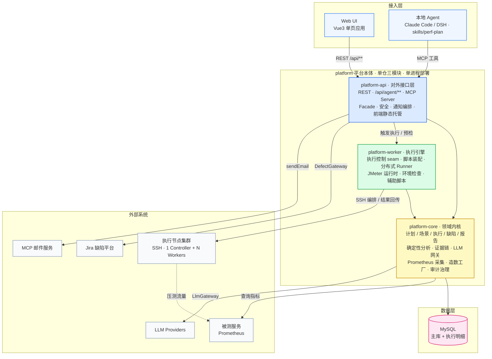
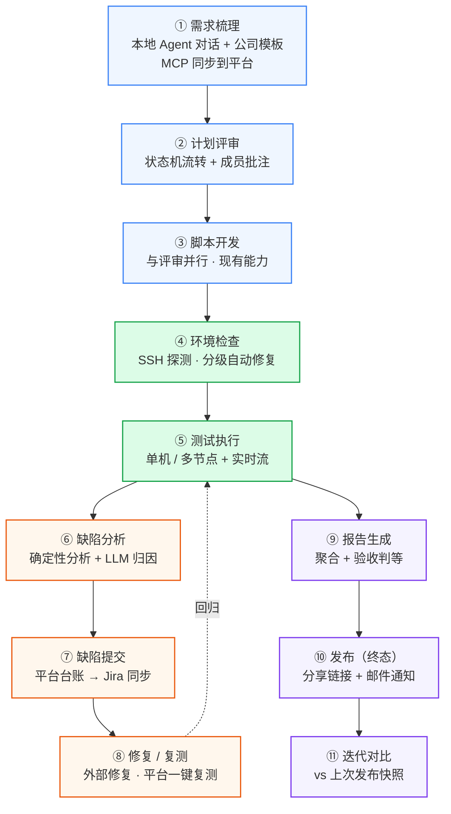

# 平台目标架构与待完成计划

> 生成于 2026-08-28 头脑风暴（grill 会话）。本文档是**未来目标**与**待办大纲**的唯一权威来源，实现时按项拆 Issue。
> 旧需求见 `docs/requirements-spec.md`（其"版本路线图"章节已同步更新）。

## 1. 定位与范围

- **定位**：企业团队内部落地推广级别的性能测试平台（当前处于开源吸粉阶段，无真实用户；"吸粉"不是目标）。
- **范围**：聚焦性能测试本身的完整闭环——**需求 → 环境检查 → 测试执行 → 缺陷提交/分析/修复 → 复测 → 生成报告 → 发布 → 邮件通知 → 迭代间对比**。
- **边界**：不要求所有环节都堆在平台上。缺陷管理通过 Jira 等外部平台承载（平台只做台账+同步），邮件通过 MCP 邮件服务发送（平台只做模板与清单配置）。
- **运行环境**：仅在测试环境内部使用，不考虑单点故障、高可用、多租户售卖；"分布式"仅指压测执行多节点加压。

## 2. 头脑风暴决策记录

> 这些是本次梳理定死的口径，实现时照此执行，变更需回到本文档更新。

| # | 决策 | 内容 |
|---|------|------|
| D1 | 计划文档形态 | 压测计划 = **结构化字段**（目标指标/验收标准/环境/关联场景/结论）+ **Markdown 正文**；两层并存 |
| D2 | 计划状态机 | 草稿 → 待评审 → 评审中（批注）→ 已通过 → 执行中 → **已发布（终态）**；评审人 = 项目成员；**发布权限 = 计划负责人/项目管理员**；分享链接带有效期、可撤销 |
| D3 | AI 生成计划 | 平台提供 **MCP 接口**（模板/创建/读取/更新/查询）+ 模板（内置通用 + 项目自定义 Markdown 占位符）；**本地 Agent 通过仓库内 `skills/perf-plan/` 梳理需求、生成、同步**；平台内与本地可交替编辑 |
| D4 | 文档自动回填 | 执行摘要、环境检查结果、缺陷清单**自动追加**；最终结论**半自动**（判等自动算，发布前人工确认） |
| D5 | 编辑冲突 | revision 号 + **双栏差异 + 三选一**（保留平台版/采纳本地版/手改）；MCP 更新冲突返回 409 + 差异文本；**不做自动覆盖、不做行级合并** |
| D6 | 验收判等 | 验收标准实体挂在计划上（目标 TPS/P95/P99/错误率/并发峰值/容量），报告自动判定 + 人工确认 |
| D7 | 环境检查 | **独立预检任务**，平台本机优先，**SSH 连目标服务器探测**；SSH 做不了的 push 脚本到目标机执行；结果三态：本身 OK / 有问题已修复 / 需手动修复（附建议与方法） |
| D8 | 自动修复边界 | 三级：**低风险默认自动修**（连接池/超时等应用配置）/ 中风险需勾选（ulimit/内核参数）/ 只建议（DB/中间件）；所有修复留 diff 可回滚，全局开关；**检查项插件式扩展，平台默认只做通用低风险排查，项目特性自行扩展自担风险** |
| D9 | 缺陷闭环 | 平台内置**缺陷台账**（记录+关联执行/样本/报告），同步到 **Jira 为第一个 adapter**（可插拔 gateway，后续按需扩展）；Jira 凭据密文存储、字段固定映射；状态回拉 = 手动刷新 + 定时轮询（不做 webhook）；**手动推送为主 + 可配自动推送** |
| D10 | 通知 | 发送动作走 **MCP `sendEmail`**；平台做**模板配置 + 抄送清单配置**，配置在项目（默认）+ 计划（覆盖）两级；抄送默认按项目成员角色，**发送前确认可临时修改**；时机 = 执行完成/失败、计划发布；模板变量先做 5 个核心（执行摘要/报告链接/判定结果等） |
| D11 | 迭代对比 | **发布版本快照为主**（计划"已发布"固化快照，下次同计划执行自动对比上次快照）+ **场景手动基线兜底**；快照内容 = 场景列表 + 脚本版本 + 线程组配置 + 结果摘要；对比内容 = TPS/P95/P99/错误率 + 资源指标 + 差异判定；对比时自动检测被测侧代码变更（复用现有 verification 模块） |
| D12 | MCP 全功能化 | 大部分功能 MCP 化，MCP 与 REST **共用 facade seam**；**随功能落地逐个暴露工具**，不单独立"全量 MCP 映射"项目；白名单不进 MCP：登录/密钥管理、发布终态、删除类、自动修复 |
| D13 | 架构拆分 | 单仓多模块：`platform-core` / `platform-api` / `platform-worker`（详见 §3）；worker 架构图按**可独立进程**画，落地先同进程、留独立启动类 |
| D14 | 数据层 | 主库 + 执行明细**一次性统一迁 MySQL**；H2 仅保留给本地无依赖开发（profile） |
| D15 | 部署 | **后端托管前端**（前端 build 产物打进 api jar，单进程起全部）+ `scripts/start.sh` + 部署文档；Dockerfile 顺手加一个不承诺维护；CI 排最后 |
| D16 | 分布式现状 | 多节点分布式压测**已支持**（1 controller + N workers，前后端链路完整）；缺的是**容量调度/自动分片**（按目标并发自动选节点/分配负载/容量感知），列为远期 |

## 3. 目标架构

### 3.1 全景图

### 3.2 模块职责

| 模块 | 职责 | 依赖 | 备注 |
|------|------|------|------|
| `platform-core` | 领域模型与持久化（计划/场景/执行/缺陷/环境检查/报告/项目/成员）、确定性分析引擎、证据链、LLM 网关、监控采集、造数工厂、审计与治理 | 无 Web 依赖 | 纯领域，不 import 任何 Controller/MCP |
| `platform-api` | REST 控制器、Agent 面（`/api/agent/**`）、MCP Server（工具注册）、Facade 层、安全（登录/API Key）、通知编排、前端静态托管 | 只依赖 core | MCP 与 REST 共用 facade seam |
| `platform-worker` | 执行控制 seam（`ExecutionControlService`）、脚本装配、分布式 Runner、JMeter 运行时与 `jmeter-functions` 产物、环境检查执行器、辅助脚本执行 | 依赖 core | 目标态可独立进程；落地先同进程 + 独立启动类 |
| 前端（独立 Vue3 项目） | 全部页面 | — | build 产物打进 api jar（D15） |
| `skills/perf-plan/` | 本地 Agent 生成压测计划用的 skill（对话梳理 → 拉模板 → 生成 → MCP 同步） | 平台 MCP 工具 | 随仓库分发 |

### 3.3 依赖规则

- 依赖方向单向：`api → core`、`worker → core`；core 不得反向依赖。
- 执行启停/脚本装配等既有 seam 决策（见 `CONTEXT.md`）保持不变，拆模块只挪边界不挪语义。

## 4. 核心闭环与平台分工

| 环节 | 平台内 | 平台外 |
|------|--------|--------|
| 需求梳理 | 模板管理、MCP 接口、计划文档存储 | 本地 Agent 对话生成 |
| 计划评审 | 状态机、批注、评审人（项目成员） | — |
| 脚本开发 | 脚本编辑/版本/HTTP 调试/函数库（现有） | 本地 JMeter 工具（现状不变） |
| 环境检查 | 预检任务、清单、自动修复记录、结果回填 | SSH 到目标服务器执行 |
| 测试执行 | 触发/控制/实时流/结果 | JMeter 在远端节点跑 |
| 缺陷 | 台账、关联、分析报告、同步推送 | Jira 承载缺陷流转 |
| 通知 | 模板、抄送清单、触发时机 | MCP 邮件服务实际发送 |
| 发布 | 终态动作、只读分享链接 | 导出 PDF/Word/HTML 供线下 |

## 5. 待完成功能大纲（按优先级）

> 状态：⬜ 未开始｜🔄 进行中｜✅ 已完成。**实施顺序由 P0 到 P3；同优先级内按"闭环断点优先"。**

### P0 —— 地基与闭环两端（先做）

| ID | 工作项 | 状态 | 依赖 | 完成口径（验收） |
|----|--------|------|------|------------------|
| P0-1 | **计划文档模块重构**：TaskPlan 升级为压测计划文档（结构化字段 + Markdown 正文）；状态机 D2；评审流程与批注；模板体系（内置 + 项目自定义）；自动回填 D4；revision 冲突三选一 D5；发布终态 | ⬜ | — | 一个计划能从草稿走到"已发布"，中间可评审、可批注、可被本地 Agent 同步修改且冲突可手工处理 |
| P0-2 | **MCP 计划工具集**：`plan_templates` / `plan_create` / `plan_get` / `plan_update` / `plan_query`（发布不进 MCP，D12）；仓库内 `skills/perf-plan/` skill | ⬜ | P0-1 | 本地 Agent 仅凭 MCP + skill 完成"梳理→生成→同步→再修改"全流程 |
| P0-3 | **验收标准实体 + 自动判等**：验收指标挂计划，分两层——**场景级指标**（每场景 TPS/RT/错误率）+ **计划级总体判定**；报告自动判定通过/不通过 + 人工确认；结论回填文档 | ⬜ | P0-1 | 一次执行结束，报告直接给出"过/不过 + 哪些指标超标"，场景级明细可下钻 |
| P0-4 | **MySQL 一次性迁移**：主库 + 执行明细（SQLite）统一迁 MySQL；H2 留本地开发 profile；部署初始化说明 | ⬜ | — | 全量测试通过，Docker 起 MySQL 后平台可开箱运行，本地无 MySQL 时仍可用 H2 profile |

### P1 —— 闭环中部补强

| ID | 工作项 | 状态 | 依赖 | 完成口径（验收） |
|----|--------|------|------|------------------|
| P1-1 | **环境检查**：独立预检任务（平台本机 SSH 探测，push 脚本兜底）；插件式检查项；三级自动修复边界 D8；三态结果清单 + 修复建议；结果回填计划文档 | ⬜ | P0-1 | 对一台"配置有问题"的服务器跑预检，输出三态清单；低风险项可一键修复且留 diff |
| P1-2 | **缺陷台账 + Jira 同步**：缺陷记录与执行/样本/报告关联；缺陷来源 = 失败样本 + **慢请求 TopN 明细** + 人工登记；可插拔 DefectGateway；Jira adapter（凭据密文、字段映射）；手动/自动推送；状态轮询回拉 | ⬜ | — | 从失败/慢请求样本一键生成缺陷单推送到 Jira；Jira 状态变更后平台内可见；缺陷修复后可**一键复测**（重跑原场景 + 自动对比） |
| P1-3 | **通知（MCP 邮件）**：模板 + 抄送清单配置（项目默认 + 计划覆盖）；按角色抄送 + 发送前确认可改；时机 = 完成/失败/发布；5 个核心模板变量 | ⬜ | P0-1 | 执行失败/计划发布后，按清单发邮件（走 MCP sendEmail），发送前有确认步骤 |
| P1-4 | **迭代对比**：发布版本快照 + 手动基线兜底（D11）；同计划执行 vs 快照自动对比；TPS/P95/P99/错误率 + 资源指标 + 差异判定；**复用 verification 模块自动检测被测侧代码变更**，把"性能变差"与"改了什么"关联起来 | ⬜ | P0-1、P0-3 | 计划第二次发布后，同计划再执行自动给出"相对上次快照"的差异报告，并列出期间被测侧变更 |
| P1-5 | **CSV 测试数据管理**：参数文件上传、版本管理、执行时分发到各节点；与脚本 CSV 步骤联动 | ⬜ | — | 上传一个 CSV，配置到场景，多节点执行时每个节点都拿到该文件 |

### P2 —— 工程与规模

| ID | 工作项 | 状态 | 依赖 | 完成口径（验收） |
|----|--------|------|------|------------------|
| P2-1 | **部署整理（最小版）**：后端托管前端单 jar；`scripts/start.sh`；部署文档；Dockerfile（不承诺维护） | ⬜ | P0-4 | `./scripts/start.sh` 一条命令起全部，页面 + API 同一端口可用 |
| P2-2 | **容量调度/自动分片**（远期）：按目标并发自动选节点、负载分配、节点容量感知 | ⬜ | — | 指定目标并发数，平台自动决定用几个 worker、各分多少 |
| P2-3 | **执行数据保留与清理**：执行明细/采样/失败样本的保留周期策略 + 过期清理任务 | ⬜ | P0-4 | 按项目/计划配置保留时长，过期自动清理，存储不无限膨胀 |
| P2-4 | **执行中监控告警**：目标资源/错误率阈值告警 + 可选自动熔断 | ⬜ | P1-3 | 压测中指标越线即通知，可选自动停止执行 |

### P3 —— 企业化与甜点（最低优先级）

| ID | 工作项 | 状态 | 依赖 | 备注 |
|----|--------|------|------|------|
| P3-1 | 多团队空间 + 细粒度 RBAC | ⬜ | — | 企业多团队共用时才需要 |
| P3-2 | AI 生成脚本（OpenAPI/自然语言 → JMX，REQ-SCRIPT-009） | ⬜ | — | 甜点 |
| P3-3 | CI（构建/测试流水线） | ⬜ | — | 团队规模大了再上 |
| P3-4 | SSO、审计合规扩展 | ⬜ | — | 仅预留位，不进近期计划 |
| P3-5 | 执行节点健康巡检/平台运行监控（REQ-DIST-004） | ⬜ | — | 节点离线/异常在平台内可见 |
| P3-6 | 定时/周期执行（按计划 cron 自动回归） | ⬜ | P1-4 | **优先级最低，最后再考虑** |

## 6. 明确不做 / 保留现状

- **多节点分布式压测**：已支持（D16），不重复立项。
- **MCP 白名单**（D12）：登录/密钥管理、发布终态、删除类、自动修复默认不进 MCP。
- 旧路线图中的甜点项（多引擎导出、.jmx 下载、Word 导出增强、造数导出、Groovy 函数调试）维持"未排期"状态，不进 P0–P3。执行中监控告警已入 P2-4，节点健康巡检已入 P3-5。
- 通知渠道仅 MCP 邮件，不做 IM webhook；评审流转不发通知（仅执行完成/失败、计划发布）。
- 微服务化、多仓拆分：明确不做（D13 单仓多模块）。

## 7. 实施节奏建议

1. **第一批（地基）**：P0-4 MySQL 迁移 + P0-1 计划文档重构同步开工——计划重构动到 TaskPlan/Scenario/Execution 关系，与数据层改造天然同批；后端多模块拆分（`core/api/worker`）作为**并行轨道小步做**：每批功能顺带挪一个模块边界，不单独停工重构。
2. **第二批**：P0-2 MCP + skill、P0-3 判等——闭环两端接通。
3. **第三批起**：P1 按 P1-1 → P1-2 → P1-3 → P1-4 → P1-5 顺序推进（每项独立可交付）。
4. 每项开工前：把本文档对应行转为 GitHub Issue，验收口径作为 Issue 的完成定义。

## 8. 文档维护约定

- 本文档 = 功能大纲与架构目标的**权威来源**；`docs/requirements-spec.md` 保留需求细节，路线图章节指向本文档。
- 任何决策变更（D1–D16，后续新增继续编号）必须更新 §2 对应行并注明变更日期。
- `CONTEXT.md` 在模块拆分落地后同步更新模块地图。
