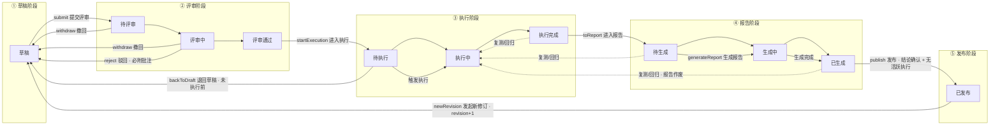
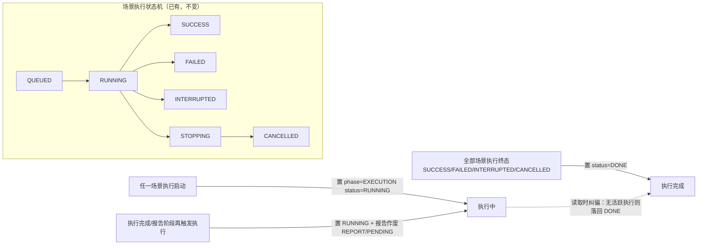

# P0-1 计划文档模块重构 —— 详细设计

> 日期：2026-09-02（2026-09-02 修订：二级状态模型 + 结构化模块，见 §18 变更记录）
> 来源：`docs/architecture-and-roadmap.md` P0-1 行，遵循决策 D1/D2/D3/D4/D5/D6/D11/D12。
> 本文档是 P0-1 的设计规格；验收口径以路线图为准，实现按此文档拆 Issue。

## 1. 目标与验收口径

**验收口径（路线图原文）**：一个计划能从草稿走到"已发布"，中间可评审、可批注、可被本地 Agent 同步修改且冲突可手工处理。

**P0-1 范围内**：

- TaskPlan 升级为压测计划文档：**结构化模块**（基本信息 / 测试目标 / 测试范围 / 测试资源 / 结论）+ Markdown 正文（D1 修订）
- **二级状态机**：阶段 = 草稿 / 评审 / 执行 / 报告 / 发布；评审子状态 = 待评审/评审中/评审通过；执行子状态 = 待执行/执行中/执行完成；报告子状态 = 待生成/生成中/已生成（D2 修订，见 §4）
- 评审流程：项目成员批注、通过/驳回、撤回（D2）
- 场景设计增强：场景目的/说明字段 + 场景设计卡片（并发模型/线程组预设/预期指标扩展位）（§3.4）
- 模板体系：内置通用模板 + 项目自定义模板，Markdown 占位符渲染（D3）
- 自动回填：执行摘要自动追加到文档正文；回填机制预留环境检查/缺陷清单扩展点（D4）
- revision 冲突三选一：409 + 双栏差异 + 保留平台版/采纳本地版/手改（D5）
- 发布终态：发布权限校验、发布快照（D11 预埋）、只读分享链接（D2）

**P0-1 范围外（由后续任务承接，见 §16）**：

- MCP 计划工具集（P0-2）、验收标准实体与自动判等（P0-3）、环境检查（P1-1）、迭代对比（P1-4）、缺陷台账/通知（P3-7/P3-8）
- 行级/锚定批注、自动合并、历史版本追溯（D5 明确不做自动覆盖与行级合并，历史追溯未要求）

## 2. 现状盘点与约束（代码事实）

> 包根：`backend/src/main/java/com/yr/perftest/platform`。

| 事实 | 位置 | 对设计的影响 |
|------|------|--------------|
| `TaskPlan` 是纯字段 record（id/projectId/name/remark/默认节点/监控目标），无状态、无正文 | `task/TaskPlan.java`、`task/PersistentTaskPlanRecord.java` | 状态机、正文、结构化模块全部是新增 |
| 计划-场景-执行经 `scenarioId` 关联，计划/项目在执行中由 join 派生 | `task/ScenarioExecution.java`、`task/ExecutionQueryService.java:257` | 执行摘要回填按 planId 聚合已有现成查询 |
| 执行状态机 `QUEUED→RUNNING→SUCCESS/FAILED/INTERRUPTED`，`RUNNING→STOPPING→CANCELLED` | `execution/ExecutionStatus.java` | 计划"执行中/执行完成"由执行生命周期事件驱动（§4.4） |
| 执行启停唯一 seam 是 `ExecutionControlService.start` | `task/ExecutionControlService.java`（CONTEXT.md C1） | **执行门禁必须加在这条 seam 上**，新入口（快捷执行）也必须走它 |
| 快捷执行：前端"脚本列表 → 执行"先建计划（`/task-plans`）再建场景再触发 | `frontend/src/composables/useTaskPlans.ts:409` `runScriptAsset` | 若门禁生效，此流程需改造为服务端合并端点（§10.3） |
| 登录体系存在：Bearer token → `AuthenticationFilter` 设置 SecurityContext，`HumanPrincipal(username, SystemRole)` | `config/AuthenticationFilter.java:42`、`identity/HumanPrincipal.java` | 新端点从 SecurityContext 取身份；不再信任裸 `X-User` 头 |
| 项目成员模型存在但未在计划接口强制：`project.ownerUsername` + `project_members(username, OWNER/MEMBER)` | `project/PersistentProjectRecord.java:30`、`PersistentProjectMemberRecord.java` | 评审/发布权限要新建一层访问判定（§13） |
| 系统级 `SystemRole.ADMIN` 存在 | `identity/SystemRole.java` | 系统 ADMIN 全权兜底 |
| 回填数据源现成：`ExecutionSummary`（executionId/planId/throughput/p95/errorRate/status）与 `ReportDataService.aggregateByPlan` | `facade/data/ExecutionSummary.java`、`report/ReportDataService.java:59` | 回填与报告生成直接复用，不新建查询 |
| 无 `@Version` 乐观锁先例；seed 模块有手工 `config_version`/`version_no` 计数先例 | `seed/PersistentSeedCaptureStrategyRecord.java:50` | revision 用普通 INT 列 + 应用层比对即可，与 D5 语义一致 |
| 无 Flyway/Liquibase，`ddl-auto: update` + 手写 `docs/database/mysql-schema.sql` | `application.yml:8-10` | 新列新表同时改实体与 sql 文件（P0-4 并行批次） |
| 前端无 Markdown 编辑器依赖；ant-design-vue 4 + Vue 3.5 | `frontend/package.json` | 需引入编辑组件（§14.5） |
| 后端测试为 JUnit 5 + `@SpringBootTest` 集成测试与 MockMvc API 测试两种风格 | `backend/src/test/java/.../task/` | 新代码按两种风格补测试（§17） |
| 无任何 review/comment/revision 域概念（grep 确认） | — | 批注、状态机均为绿地 |

## 3. 领域模型

### 3.1 计划文档 = 结构化模块 + Markdown 正文（D1 修订）

一份完整压测计划的构成：

```
TaskPlan（升级后）
├─ 基本信息：id / projectId / name / remark / createdBy（=负责人）/ createdAt / updatedAt
├─ 测试目标 goals         结构化清单 [{指标, 目标值, 口径, 说明}]（人读目标，如 TPS/RT/错误率/稳定性/容量）
├─ 测试范围 scope         结构化 {范围内:[], 范围外:[]}
├─ 测试资源 resources     结构化 {人力:[{姓名,角色}], 时间窗口:{起,止,备注}}
│                         + 执行资源沿用既有列：defaultControllerNodeId / defaultWorkerNodeIds / defaultMonitorTargetIds
├─ 场景设计 scenarios     task_scenarios（增强：场景目的 purpose 列，见 §3.4）
├─ 结论 conclusion        文本；发布时人工确认（P0-3 起为"判等预填 + 人工确认"半自动）
├─ Markdown 正文 body     叙述性内容（背景/风险/排期/附录 + 系统回填区块）
├─ 文档修订 revision      冲突控制（D5）
├─ 二级状态 phase+status  见 §4
└─ publishedAt            发布时间（终态时间戳）
```

- 每类结构化模块一个 JSON 列存储（`goals_json/scope_json/resources_json`），类型化读写（§11）。
- "验收标准实体"属 P0-3（场景级阈值 + 计划级判定，机器判等）；P0-1 的 `goals` 是**人读目标清单**，两者并存不重复建设（边界见 §16）。
- "关联场景"即 `task_scenarios`，不新增映射表。

### 3.2 新增实体

| 实体 | 职责 | 表 |
|------|------|-----|
| `PlanComment` | 评审批注 + 系统流转记录 | `plan_comments` |
| `PlanTemplate` | 计划模板（内置 + 项目自定义） | `plan_templates` |
| `PlanPublishSnapshot` | 发布时固化的文档+场景+结果摘要快照（P1-4 消费） | `plan_publish_snapshots` |
| `PlanShareToken` | 已发布计划的只读分享链接 | `plan_share_tokens` |

### 3.3 新增服务与包结构

遵循"拆模块只挪边界不挪语义"，P0-1 不拆 Maven 模块（模块拆分是路线图 §7 的并行轨道），新类放 `task/plandoc` 子包：

- `task/plandoc/PlanPhase.java` / `PlanStatus.java` — 二级状态枚举
- `task/plandoc/PlanDocumentService.java` — 文档读写（结构化模块 + 正文）、revision 冲突、回填追加
- `task/plandoc/PlanWorkflowService.java` — 状态机流转、批注、报告阶段、发布快照、分享链接、模板 CRUD
- `task/plandoc/PlanAccess.java`（+ `project/ProjectAccessResolver.java`）— 权限判定
- `task/plandoc/PlanValidationException.java` / `PlanStateException.java` / `PlanRevisionConflictException.java`
- `task/ExecutionLifecycleEvent.java` + `task/plandoc/PlanExecutionLifecycleListener.java` — 执行启停驱动计划状态 + 执行完成回填
- `api/PlanDocumentController.java` — 新 REST 面

P0-2 的 MCP 工具直接调用这两个 domain service（facade seam 共用），不额外建 facade 类。

### 3.4 场景设计增强

- `task_scenarios` 新增 `purpose`（场景目的/说明，TEXT 可空）——回答"这个场景验证什么"。
- 前端场景 Tab 升级为**场景设计卡片**：目的、并发模型（由线程组预设推导的梯度/固定模型展示）、线程组预设明细、最新执行状态；**预期指标**（P0-3 验收标准实体）与**测试数据**（P1-5 CSV）作为扩展位预留展示。
- 不新增并发模型枚举：并发梯度语义已由 `threadGroupConfigs`（threads/rampUp/duration/sortOrder 多档）承载，前端推导展示即可。

## 4. 二级状态机（D2 修订）

### 4.1 阶段与子状态

| 阶段 `phase` | 子状态 `status` | 含义 |
|--------------|----------------|------|
| 草稿 DRAFT | 草稿 DRAFT | 自由编辑，唯一可改文档的阶段 |
| 评审 REVIEW | 待评审 PENDING | 已提交，等待评审人开始 |
| | 评审中 IN_REVIEW | 评审人批注中 |
| | 评审通过 APPROVED | 评审结论通过（休息态，等待进入执行） |
| 执行 EXECUTION | 待执行 PENDING | 已进入执行阶段，尚未有执行（本修订） |
| | 执行中 RUNNING | 至少一个场景执行活跃 |
| | 执行完成 DONE | 本轮全部执行结束（休息态，可复测/进入报告） |
| 报告 REPORT | 待生成 PENDING | 已进入报告阶段，等待生成 |
| | 生成中 GENERATING | 聚合生成中（瞬态） |
| | 已生成 DONE | 报告可用，发布前需结论确认 |
| 发布 PUBLISH | 已发布 PUBLISHED | 终态：快照固化、内容冻结 |

存储两列：`phase` + `status`（服务层保证组合合法，非法组合拒绝写入）。

### 4.2 完整流转图



### 4.3 执行阶段与场景执行状态机的联动（事件驱动）

计划执行阶段子状态由**执行生命周期事件**维护（写路径保证一致性），读取时做惰性纠偏（崩溃恢复）：



- 事件由 `ExecutionControlService.start`（启动）与执行终态写入路径（结束）发布，`PlanExecutionLifecycleListener` 落状态。
- 惰性纠偏：读取计划时若 `EXECUTION/RUNNING` 但实际无活跃执行 → 校正为 `EXECUTION/DONE`；反之亦然。防止进程崩溃/事件丢失造成状态滞留。
- 任何新执行启动都会把报告阶段重置为 `REPORT/PENDING`（作废旧报告，保证发布前报告反映最新执行）。

### 4.4 转移动作与权限

| 动作 | 前置 | 后置 | 允许者 | 附注 |
|------|------|------|--------|------|
| `submit` 提交评审 | DRAFT/DRAFT | REVIEW/PENDING | 负责人 / 项目 OWNER / 系统 ADMIN | |
| `startReview` 开始评审 | REVIEW/PENDING | REVIEW/IN_REVIEW | 项目成员 | 记录系统批注 |
| `approve` 评审通过 | REVIEW/IN_REVIEW | REVIEW/APPROVED | 项目成员 | 记录系统批注（含审批人）；自审允许（决策 2） |
| `reject` 驳回 | REVIEW/IN_REVIEW | DRAFT/DRAFT | 项目成员 | **必须附批注** |
| `withdraw` 撤回 | REVIEW/PENDING、REVIEW/IN_REVIEW | DRAFT/DRAFT | 负责人 / 项目 OWNER / 系统 ADMIN | |
| `backToDraft` 退回草稿 | REVIEW/APPROVED、EXECUTION/PENDING | DRAFT/DRAFT | 负责人 / 项目 OWNER / 系统 ADMIN | 仅本修订未产生执行时可用（EXECUTION/PENDING 天然满足） |
| `startExecution` 进入执行 | REVIEW/APPROVED | EXECUTION/PENDING | 项目成员 | 评审与执行的分界点 |
| 触发执行（含复测） | EXECUTION/PENDING、EXECUTION/DONE、REPORT/PENDING、REPORT/DONE | EXECUTION/RUNNING | 项目成员 | 复测/回归不重新评审；新执行启动重置报告为 REPORT/PENDING |
| 执行全部结束 | EXECUTION/RUNNING | EXECUTION/DONE | 系统（事件） | |
| `toReport` 进入报告 | EXECUTION/DONE | REPORT/PENDING | 项目成员 | |
| `generateReport` 生成报告 | REPORT/PENDING、REPORT/DONE | REPORT/GENERATING → REPORT/DONE | 项目成员 | 复用现有 `ReportDataService` 聚合；P0-3 起附判等 |
| `publish` 发布 | REPORT/DONE 且无活跃执行 | PUBLISH/PUBLISHED | 负责人 / 项目 OWNER / 系统 ADMIN | 发布请求须携带结论（人工确认）；生成发布快照 |
| `newRevision` 发起新修订 | PUBLISH/PUBLISHED | DRAFT/DRAFT | 负责人 / 项目 OWNER / 系统 ADMIN | `revision+1`；旧发布快照保留 |

### 4.5 编辑与状态的关系

- **文档编辑（结构化模块 + 正文）仅允许在 DRAFT 阶段**。评审中要改：撤回；评审通过/待执行（未执行）要改：退回草稿。执行开始后至发布前文档不可改（评审内容即执行与发布依据）；发布后走 `newRevision`。
- 默认执行配置（默认 controller/workers/monitors，老 `PUT /api/task-plans/{id}`）：仅 DRAFT 可改。
- 场景增删改：允许于 DRAFT / REVIEW / EXECUTION（除 RUNNING）/ REPORT（脚本开发与评审并行，执行配置触发时固化，改场景只影响下一轮执行）；`EXECUTION/RUNNING` 与 `PUBLISH/PUBLISHED` 禁止（发布后冻结与 D11 快照一致性相关）。
- 回填是系统写操作，不受阶段限制、不校验 baseRevision（§8.2）。

## 5. 修订与冲突处理（D5）

### 5.1 revision 语义

- `task_plans.revision`：文档修订号，从 1 起。**任何导致文档内容变化（结构化模块或正文）的写入 `revision+1`**，包括用户编辑与系统回填。
- 默认执行配置变化**不**影响 revision（不属于文档内容）。
- 场景增删改**不**影响 revision（冲突控制只覆盖文档内容；P0-2 的 MCP `plan_update` 同样只更新文档）。

### 5.2 乐观并发控制

- 更新文档必须携带 `baseRevision`（等于读取时拿到的 revision）。
- 服务端在事务内比对：`当前 revision != baseRevision` → **409 `PLAN_REVISION_CONFLICT`**，响应体：

```json
{
  "code": "PLAN_REVISION_CONFLICT",
  "message": "计划文档已被修改（当前 revision=5，提交基于 revision=4）",
  "currentRevision": 5,
  "serverDocument": { "goals": [], "scope": {}, "resources": {}, "conclusion": "…", "markdown": "…" }
}
```

- 服务端**不落盘**请求方提交的内容（提交方自己持有本地版本），只返回当前服务器版本。不做自动覆盖、不做行级合并（D5）。

### 5.3 三选一冲突解决（UI 与本地 Agent 通用）

1. **保留平台版**：放弃本地修改，重新读取服务器版本继续工作。
2. **采纳本地版**：以 409 返回的 `currentRevision` 为新 base，重放本地全部内容（整文档覆盖，非行级合并）。
3. **手改**：以服务器版本为基底打开编辑器，人工合并后再以 `currentRevision` 提交。

MCP（P0-2）与 REST 共用同一语义：P0-2 的 `plan_update` 返回同样结构，本地 Agent 自行实现三选一（D5 的"差异文本"由双方各自持有两版全文实现）。

### 5.4 双栏差异展示

- 前端冲突弹窗左右并排展示"平台当前版"与"本地版"，结构化模块用并排表单对比，正文用行级 diff 高亮（§14.3）。

## 6. 评审与批注（D2）

### 6.1 批注模型

`plan_comments`：`id / planId / author / content / kind / createdAt`。

- `kind = REVIEW`：评审批注，项目成员在草稿/评审阶段可发（进入执行后评审批注关闭，批注只读——评审是评审阶段的事）。
- `kind = SYSTEM`：流转记录（提交评审/开始评审/通过/驳回/撤回/进入执行/进入报告/生成报告/发布/发起新修订/快捷执行自动通过/执行摘要回填），由服务写入，不可编辑删除。
- **批注为全文档级，不做行锚定**：Markdown 行号随编辑漂移，且 D5 明确不做行级合并（决策 5）。
- `PUBLISH/PUBLISHED`：批注全部只读（终态冻结）。

### 6.2 批注权限

- 新增批注：项目成员（含负责人），仅限草稿/评审阶段。
- 删除批注：作者本人 / 负责人 / 项目 OWNER / 系统 ADMIN；`SYSTEM` 批注不可删。

## 7. 模板体系（D3）

### 7.1 数据模型

`plan_templates`：`id / projectId(null=内置) / name / description / content(Markdown) / builtin / createdBy / createdAt / updatedAt`。

- 内置模板：`builtin=true, projectId=null`，启动时由初始化器 seed（存在即跳过），不可编辑删除。
- 项目自定义模板：`builtin=false, projectId=项目`，项目 OWNER / 系统 ADMIN 可增删改，项目成员可查看使用。

### 7.2 占位符与渲染

- 占位符语法 `{{name}}`。P0-1 支持 `{{planName}}`（文本替换），机制按需扩展。
- 模板正文是**叙述骨架**（背景与目标/风险与预案/排期与协作/附录 等章节）。结构化模块（测试目标/测试范围/测试资源/结论）由表单填写、与正文并存，**不复制进正文**（避免两份数据不同步）；计划文档的完整呈现与导出由前端/分享页组装"结构化模块 + 正文"。
- 渲染发生在"从模板创建计划"：`{{planName}}` 替换为计划名，正文骨架原样保留。
- 首版内置模板一份："通用压测计划"（背景与目标 / 风险与预案 / 排期与协作 / 附录 章节骨架 + `{{planName}}`）。

## 8. 自动回填（D4）

### 8.1 机制

- 系统在正文维护受管区块 `## 执行记录`，回填只向该区块**追加**条目、不触碰其它正文（用户可自由编辑该区块之外的任何内容）。
- 回填与状态维护共用 `ExecutionLifecycleEvent`：执行进入终态时，`PlanExecutionLifecycleListener` 追加条目。
- 幂等：每条目带 `<!-- backfill:execution:<executionId> -->` 标记，追加前检查正文是否已含该标记，存在则跳过。
- 回填条目模板（确定性拼接，不调用 LLM）：

```markdown
<!-- backfill:execution:123 -->
### 2026-09-02 14:30 · <场景名> · <执行名>
- 状态：SUCCESS
- 样本 12000 ｜ 吞吐 158.3 TPS ｜ P95 96 ms ｜ 错误率 0.42%
```

- 回填数据来自 `ExecutionSummary`（`facade/data/ExecutionSummary.java`）。
- 环境检查结果（P1-1）、缺陷清单（P3-7）回填走同一追加机制，P0-1 只交付机制 + 执行摘要一个源。

### 8.2 回填与 revision

回填是系统写入：不校验 baseRevision、不受阶段编辑限制，但 **`revision+1`**（内容确实变了）。本地 Agent 若持有旧 revision 提交会收 409 → 重新读取（此时正文含回填条目）→ 保留自己的修改以新 base 提交，即现有冲突流程，无特殊处理。

### 8.3 结论与报告

P0-1 的 `conclusion` 字段在**发布时由发布人填写/确认**（publish 请求携带）；P0-3 起判等结果自动预填，发布前人工确认（D4 半自动）。

## 9. 发布终态、快照与分享（D2/D11）

### 9.1 发布动作

`publish`（REPORT/DONE → PUBLISH/PUBLISHED，权限见 §4.4）：

1. 校验无活跃执行（有则 409）。
2. 校验请求携带结论（发布人确认；为空则 400）。
3. 生成发布快照（§9.2）。
4. 置 `phase=PUBLISH, status=PUBLISHED, publishedAt=now`，写系统批注"已发布（revision=N）"。
5. 发布后：文档、默认配置、场景均冻结；继续执行（P1-4 同计划再执行场景）与报告生成不受影响；要变更内容走 `newRevision`。

### 9.2 发布快照（D11 预埋）

`plan_publish_snapshots`：`id / planId / revision / publishedBy / publishedAt / docJson / scenarioJson / summaryJson`，`unique(planId, revision)`。

- `docJson`：发布时的结构化模块（goals/scope/resources/conclusion）+ 正文全文。
- `scenarioJson`：场景列表（场景名/脚本版本/线程组配置）。
- `summaryJson`：各场景最近一次成功执行的结果摘要（复用 `ReportDataService`/`ExecutionQueryService` 聚合结果）。
- P1-4 迭代对比直接消费最近两个快照；`newRevision` 后再发布产生新 revision 快照，旧快照保留。

### 9.3 只读分享链接

- `plan_share_tokens`：`id / planId / token(UUID) / expiresAt / revokedAt / createdBy / createdAt`。
- 创建：仅已发布计划，权限 = 负责人 / 项目 OWNER / 系统 ADMIN，可选有效期（默认 30 天）。
- 撤销：删除/置 `revokedAt`；过期或撤销后访问返回 404。
- 公开读取：`GET /api/share/plans/{token}`，无需登录（SecurityConfiguration 放行 `/api/share/**`），返回结构化模块 + 正文（前端渲染）+ 发布时间，不返回场景/执行明细、批注与快照。

## 10. 执行门禁与快捷执行改造

### 10.1 门禁规则

- `ExecutionControlService.start`（唯一 seam）在现有校验后追加：场景 → 计划，要求计划处于 `EXECUTION` 或 `REPORT` 阶段（即评审已通过），否则抛 `PlanStateException`（409，附"请先通过评审并进入执行阶段"）。
- 允许触发的前置：`EXECUTION/PENDING、EXECUTION/DONE、REPORT/PENDING、REPORT/DONE`（复测/回归）；`EXECUTION/RUNNING` 时按现有并发限制规则处理（当前平台同一时刻限 1 个执行）。
- 影响面：计划详情页执行按钮、场景执行按钮、agent 面 `StartExecutionTool`。agent 面行为收紧为"先审批后执行"（闭环本意）；前端按钮在计划不可执行时禁用并提示。

### 10.2 现有行为变化（明确声明）

- 今天任何状态都可执行；门禁后**未通过评审的计划不可执行**。这是 P0 闭环的刻意收紧（决策 1）。

### 10.3 快捷执行改造

现状 `runScriptAsset`（`useTaskPlans.ts:409`）在前端串三步。改造为服务端合并端点：

`POST /api/scripts/{scriptVersionId}/quick-execute`
→ 服务端事务：创建计划（`phase=EXECUTION, status=PENDING`）→ 写系统批注"快捷执行自动通过评审" → 创建场景 → 走 `ExecutionControlService.start` 触发（→ RUNNING）→ 返回 executionId。
前端 `runScriptAsset` 改为调用该端点。**自动放行逻辑只存在于服务端一处**，普通 `POST /task-plans` 创建的计划一律草稿，不提供绕过评审的参数。

## 11. 数据模型 DDL

### 11.1 task_plans 新增列

```sql
ALTER TABLE task_plans
  ADD COLUMN phase          VARCHAR(20)  NOT NULL DEFAULT 'DRAFT',
  ADD COLUMN status         VARCHAR(20)  NOT NULL DEFAULT 'DRAFT',
  ADD COLUMN goals_json     LONGTEXT     NULL,   -- [{metric,target,basis,note}]
  ADD COLUMN scope_json     LONGTEXT     NULL,   -- {included:[], excluded:[]}
  ADD COLUMN resources_json LONGTEXT     NULL,   -- {personnel:[{name,role}], window:{start,end,note}}
  ADD COLUMN conclusion     TEXT         NULL,
  ADD COLUMN body           LONGTEXT     NULL,
  ADD COLUMN revision       INT          NOT NULL DEFAULT 1,
  ADD COLUMN published_at   DATETIME     NULL;
```

存量行迁移：`DRAFT/DRAFT`、`revision=1`、模块与正文为 null，无数据订正需求（无生产数据）。

### 11.2 task_scenarios 新增列

```sql
ALTER TABLE task_scenarios
  ADD COLUMN purpose TEXT NULL;   -- 场景目的/说明（场景设计增强）
```

### 11.3 新表

```sql
CREATE TABLE plan_comments (
  id         BIGINT AUTO_INCREMENT PRIMARY KEY,
  plan_id    BIGINT      NOT NULL,
  author     VARCHAR(80) NOT NULL,
  content    TEXT        NOT NULL,
  kind       VARCHAR(20) NOT NULL,            -- REVIEW / SYSTEM
  created_at DATETIME    NOT NULL,
  KEY idx_plan_comments_plan (plan_id, id)
);

CREATE TABLE plan_templates (
  id          BIGINT AUTO_INCREMENT PRIMARY KEY,
  project_id  BIGINT       NULL,              -- NULL = 内置
  name        VARCHAR(160) NOT NULL,
  description VARCHAR(1000) NULL,
  content     LONGTEXT     NOT NULL,
  builtin     TINYINT(1)   NOT NULL DEFAULT 0,
  created_by  VARCHAR(80)  NOT NULL,
  created_at  DATETIME     NOT NULL,
  updated_at  DATETIME     NOT NULL,
  KEY idx_plan_templates_project (project_id)
);

CREATE TABLE plan_publish_snapshots (
  id            BIGINT AUTO_INCREMENT PRIMARY KEY,
  plan_id       BIGINT      NOT NULL,
  revision      INT         NOT NULL,
  published_by  VARCHAR(80) NOT NULL,
  published_at  DATETIME    NOT NULL,
  doc_json      LONGTEXT    NOT NULL,
  scenario_json LONGTEXT    NOT NULL,
  summary_json  LONGTEXT    NULL,
  UNIQUE KEY uk_plan_snapshot (plan_id, revision)
);

CREATE TABLE plan_share_tokens (
  id         BIGINT AUTO_INCREMENT PRIMARY KEY,
  plan_id    BIGINT      NOT NULL,
  token      VARCHAR(64) NOT NULL,
  expires_at DATETIME    NULL,
  revoked_at DATETIME    NULL,
  created_by VARCHAR(80) NOT NULL,
  created_at DATETIME    NOT NULL,
  UNIQUE KEY uk_share_token (token),
  KEY idx_share_plan (plan_id)
);
```

- 同步更新 `docs/database/mysql-schema.sql`；开发态依赖 `ddl-auto: update`（H2 兼容，P0-4 并行批次负责 MySQL 正式迁移）。
- 现有 `TaskPlanService.createPlan/updatePlan/deletePlan` 扩展：创建写 phase/status/revision 初始值；删除级联清理 comments/snapshots/share tokens。

## 12. REST API 设计

新端点统一挂 `api/PlanDocumentController`（认证身份取 SecurityContext `HumanPrincipal`，不再信任 `X-User` 头；未登录 401）。

### 12.1 计划文档与流转

| 方法 | 路径 | 说明 |
|------|------|------|
| GET | `/api/task-plans/{id}` | 扩展响应：`phase/status/goals/scope/resources/conclusion/body/revision/publishedAt`；`owner` 即 `createdBy` |
| PUT | `/api/task-plans/{id}/document` | 请求 `{baseRevision, goals?, scope?, resources?, conclusion?, markdown?}`；200 返回新文档 / 409 冲突（§5.2）；仅 DRAFT |
| POST | `/api/task-plans/{id}/submit` | 草稿 → 评审·待评审；body 可选 `{comment}` |
| POST | `/api/task-plans/{id}/start-review` | 评审·待评审 → 评审中 |
| POST | `/api/task-plans/{id}/approve` | 评审中 → 评审通过；body 可选 `{comment}` |
| POST | `/api/task-plans/{id}/reject` | 评审中 → 草稿；body `{comment}`（必填） |
| POST | `/api/task-plans/{id}/withdraw` | 评审·待评审/评审中 → 草稿 |
| POST | `/api/task-plans/{id}/back-to-draft` | 评审通过/执行·待执行 → 草稿（未执行前） |
| POST | `/api/task-plans/{id}/start-execution` | 评审通过 → 执行·待执行 |
| POST | `/api/task-plans/{id}/to-report` | 执行完成 → 报告·待生成 |
| POST | `/api/task-plans/{id}/generate-report` | 报告·待生成/已生成 → 生成中 → 已生成 |
| POST | `/api/task-plans/{id}/publish` | 报告·已生成 → 发布·已发布；body `{conclusion}`（必填）；有活跃执行/非报告已生成则 409 |
| POST | `/api/task-plans/{id}/new-revision` | 发布·已发布 → 草稿，revision+1 |
| PUT | `/api/task-plans/{id}` | 老端点（默认配置）保留；仅 DRAFT 可改（§4.5） |
| DELETE | `/api/task-plans/{id}` | 权限收紧为 负责人/OWNER/ADMIN（§13）；级联新表 |
| POST | `/api/projects/{projectId}/task-plans` | 创建扩展：可选 `{templateId, goals, scope, resources}`，模板渲染正文 |

### 12.2 批注 / 模板 / 分享 / 快捷执行

| 方法 | 路径 | 说明 |
|------|------|------|
| GET/POST | `/api/task-plans/{id}/comments` | 批注列表 / 新增（REVIEW） |
| DELETE | `/api/task-plans/{id}/comments/{commentId}` | 权限见 §6.2 |
| GET | `/api/projects/{projectId}/plan-templates` | 内置 + 项目自定义 |
| POST/PUT/DELETE | `/api/projects/{projectId}/plan-templates[/{id}]` | 仅项目自定义；OWNER/ADMIN |
| POST | `/api/task-plans/{id}/shares` | body `{expiresInDays?}`；仅已发布 |
| GET/DELETE | `/api/task-plans/{id}/shares[/{tokenId}]` | 列表 / 撤销 |
| GET | `/api/share/plans/{token}` | 公开只读（放行白名单） |
| POST | `/api/scripts/{scriptVersionId}/quick-execute` | §10.3 |

### 12.3 响应通用约定

- 每个计划读取响应附带 `permissions`：当前用户可执行动作列表（`EDIT/SUBMIT/START_REVIEW/APPROVE/REJECT/WITHDRAW/BACK_TO_DRAFT/START_EXECUTION/TO_REPORT/GENERATE_REPORT/PUBLISH/NEW_REVISION/DELETE/COMMENT/SHARE`），前端按钮显隐以此为准。
- 状态非法 → 409 `PLAN_STATE`（附当前 phase/status 与允许动作）；权限不足 → 403；文档不存在 → 404。

## 13. 权限模型

### 13.1 角色解析（`ProjectAccessResolver`）

对计划所在项目，解析当前用户角色：

1. 系统 `SystemRole.ADMIN` → 全权（项目 OWNER 之上）。
2. `project.ownerUsername == username` 或 `project_members.role == OWNER` → **项目 OWNER**。
3. `project_members` 存在 → **项目成员**。
4. 计划 `createdBy == username` → **计划负责人**（负责人通常也是成员；非成员负责人不单独放权，以成员身份为前提）。
5. 其它 → 拒绝（403）。

### 13.2 动作矩阵（汇总 §4.4/§6/§7/§9/§10）

| 动作 | 成员 | 负责人 | 项目 OWNER | 系统 ADMIN |
|------|:--:|:--:|:--:|:--:|
| 读计划/批注 | ✅ | ✅ | ✅ | ✅ |
| 编辑文档（草稿） | ❌ | ✅ | ✅ | ✅ |
| 改默认配置（草稿） | ❌ | ✅ | ✅ | ✅ |
| 场景增删改（非执行中/未发布） | ✅ | ✅ | ✅ | ✅ |
| submit / withdraw / backToDraft | ❌ | ✅ | ✅ | ✅ |
| startReview / 批注 | ✅ | ✅ | ✅ | ✅ |
| approve / reject | ✅ | ✅ | ✅ | ✅ |
| startExecution / toReport / generateReport | ✅ | ✅ | ✅ | ✅ |
| 触发执行（含复测） | ✅ | ✅ | ✅ | ✅ |
| publish / newRevision / 分享创建撤销 | ❌ | ✅ | ✅ | ✅ |
| 删除计划 | ❌ | ✅ | ✅ | ✅ |
| 模板管理（增删改） | ❌ | ❌ | ✅ | ✅ |
| 快捷执行 | ✅ | ✅ | ✅ | ✅ |

说明：approve 允许任意项目成员（含负责人自审）——评审人 = 项目成员（D2），最终放行由发布权限（负责人/OWNER/ADMIN）兜底（决策 2）。执行阶段动作（进入执行/进入报告/生成报告/触发执行）对项目成员开放——评审已通过，执行是团队协作行为。MCP 白名单（D12）在 P0-2 落地：publish 终态、删除类、分享创建不进 MCP，与本权限模型无冲突。

## 14. 前端设计

### 14.1 计划详情页重构（`TaskPlanDetail.vue`）

改为 Tab 结构，沿用现有项目壳路由 `/projects/:projectId/task-plans/:planId`：

- **阶段步进条**：草稿 → 评审 → 执行 → 报告 → 发布 五个阶段节点，当前阶段高亮，节点下显示子状态（评审通过/执行中/已生成等）；历史阶段显示 ✓。
- **文档 Tab**：结构化模块卡片组（测试目标清单 / 测试范围 / 测试资源 / 结论，各带编辑入口）+ Markdown 编辑器；保存带 baseRevision，409 弹冲突框（§14.3）。
- **评审 Tab**：批注时间线（REVIEW + SYSTEM 区分样式）、新增批注框、流转动作（开始评审/通过/驳回/撤回）。
- **场景 Tab**：场景设计卡片列表（目的、并发模型、线程组预设明细、最新执行状态、预期指标与测试数据扩展位占位）；执行按钮按门禁启用/禁用。
- **报告 Tab**：报告阶段状态（待生成/生成中/已生成）、生成报告按钮、报告内容预览（聚合摘要；判等区域标注 P0-3 预留）、发布前置条件清单。
- **发布 Tab**：发布按钮（需结论确认输入框 + 前置条件校验）、发布快照列表、分享链接管理。

### 14.2 计划列表（`TaskPlanList.vue`）

加阶段/子状态 badge（如"执行·执行中"）、负责人列；行内动作随权限过滤。

### 14.3 冲突三选一弹窗

- 左右双栏："平台当前版" vs "本地版"；结构化模块并排表单对比 + 正文行级 diff 高亮。
- 三个按钮：**保留平台版**（丢弃本地，重新加载）/ **采纳本地版**（以 currentRevision 重放本地全文）/ **手改**（以平台版为基底进编辑器）。
- 行级 diff 用 `jsdiff`（轻量、无渲染依赖）自绘高亮，不引重组件。

### 14.4 分享公开页

独立公开路由 `/share/plans/:token`：结构化模块 + Markdown 只读渲染，无需登录。

### 14.5 依赖与其它

- 引入 `md-editor-v3`（Vue3 原生 Markdown 编辑器），计划文档编辑与模板编辑共用。
- `TaskPlanDialog`（创建弹窗）：增加模板选择、测试目标/范围/资源输入；创建即草稿。
- 快捷执行按钮改调 `/api/scripts/{scriptVersionId}/quick-execute`。
- 新增 `frontend/src/api/plan-doc.ts` 与类型扩展（`TaskPlan` 增 phase/status/结构化模块）。

## 15. 错误处理

| 异常 | HTTP | code | 说明 |
|------|------|------|------|
| `PlanStateException` | 409 | `PLAN_STATE` | 状态非法，附当前 phase/status + 允许动作 |
| `PlanRevisionConflictException` | 409 | `PLAN_REVISION_CONFLICT` | §5.2 响应体 |
| `PlanAccessDeniedException` | 403 | `PLAN_ACCESS_DENIED` | 非项目成员/权限不足 |
| `PlanValidationException` | 400 | `PLAN_INVALID` | 参数非法（如 reject 缺批注、publish 缺结论、结构化模块格式非法） |
| 分享过期/撤销 | 404 | `SHARE_NOT_FOUND` | 不泄露计划是否存在 |

统一走现有 `PlatformExceptionHandler` 注册。

## 16. 与其它任务的边界

| 任务 | 关系 |
|------|------|
| P0-2 MCP 工具集 | 直接调用 `PlanDocumentService`/`PlanWorkflowService`；`plan_update` 复用 409 冲突语义与 `baseRevision` 参数 |
| P0-3 验收判等 | P0-1 提供 goals（人读目标清单）/conclusion 字段与报告阶段骨架；P0-3 建验收标准实体 + 判等引擎，生成报告附判等结果并预填 conclusion |
| P1-1 环境检查 | 环境检查结果回填走 P0-1 的受管区块追加机制（扩展点） |
| P1-4 迭代对比 | 消费 `plan_publish_snapshots`（P0-1 已按 D11 内容建快照） |
| P0-4 MySQL 迁移 | 并行批次：新 DDL 进 `mysql-schema.sql`，开发 H2 靠 ddl-auto |
| 模块拆分（并行轨道） | P0-1 不拆 Maven 模块；新类放 `task/plandoc`，后续挪 core 不动语义 |

## 17. 测试计划

沿用现有两种风格（JUnit 5 `@SpringBootTest` 集成 + MockMvc API）。

**状态机与权限（集成测试）**：

- 全链路：草稿 → 评审(待评审→评审中→评审通过) → 执行(待执行→执行中→执行完成) → 报告(待生成→生成中→已生成) → 发布(已发布) → 新修订(草稿) 每步成功与非法转移（409）
- 复测/回归：执行完成/报告阶段再触发 → 执行中，且报告重置为待生成
- 执行生命周期事件：执行启动置 RUNNING、全部终态置 DONE；读取时惰性纠偏（模拟事件丢失）
- 权限矩阵：成员/负责人/OWNER/ADMIN/非成员 对每个动作的允许与 403
- reject 缺批注、publish 缺结论 → 400；publish 有活跃执行/非报告已生成 → 409

**冲突与三选一**：

- 相同 baseRevision 更新成功且 revision+1；过期 baseRevision → 409 且响应含 serverDocument；以 currentRevision 重放 → 成功
- 回填 bump revision 后旧 base 提交 → 409 → 重放成功（模拟 Agent 交替编辑）

**回填**：

- 执行终态事件 → 正文追加受管区块条目且幂等（同 executionId 二次触发不重复）
- 回填不触碰 `## 执行记录` 之外的正文

**发布与分享**：

- 快照内容 = 发布时结构化模块+正文/场景/摘要；unique(planId, revision) 冲突防护
- 分享链接匿名可读、过期/撤销 404、非发布计划不可创建

**门禁与快捷执行**：

- 草稿/评审阶段计划触发执行 → 409；评审通过进入执行阶段后可执行
- quick-execute 单请求完成 建计划(EXECUTION/PENDING)+系统批注+场景+执行(RUNNING)
- 场景在 RUNNING 与已发布状态下增删改 → 409

**前端**：冲突三选一弹窗交互、阶段步进条渲染、权限驱动按钮显隐（沿用 `frontend/tests` 现有测试栈）。

## 18. 关键决策清单（请评审确认）

实现前请确认以下在路线图中未完全钉死、本设计自行拍板的点：

1. **二级状态模型（D2 修订）**：阶段 = 草稿/评审/执行/报告/发布；评审子状态 = 待评审/评审中/评审通过；执行子状态 = 待执行/执行中/执行完成；报告子状态 = 待生成/生成中/已生成；发布 = 已发布终态。评审通过后需显式"进入执行"；发布前需报告已生成 + 结论确认 + 无活跃执行。
2. **approve 权限**：任意项目成员可 approve（含负责人自审）；最终放行靠发布权限兜底。
3. **编辑冻结规则**：文档与默认配置仅草稿可编辑；评审通过/待执行（未执行）可退回草稿；执行开始后至发布前不可改文档，发布后走新修订。场景在非执行中/未发布状态可改。
4. **发布后修订**：已发布不是永久冻结，`newRevision` 回草稿继续迭代，旧快照保留（支撑 P1-4 多版本对比）。
5. **批注粒度**：全文档级批注，不做行锚定；评审批注仅草稿/评审阶段可发。
6. **分享链接**：仅已发布计划可创建，匿名只读，默认 30 天有效、可撤销。
7. **回填与 revision**：回填走系统写入（不校验 baseRevision）但 revision+1。
8. **删除收紧**：计划删除从"任何人"收紧为 负责人/项目 OWNER/系统 ADMIN。
9. **模板管理权限**：项目 OWNER/系统 ADMIN 管理模板；成员可用。内置模板 seed 于启动。
10. **新依赖**：前端 `md-editor-v3`（Markdown 编辑）+ `jsdiff`（冲突双栏 diff）。
11. **结构化模块存储**：每模块一个 JSON 列（goals_json/scope_json/resources_json）+ conclusion TEXT；场景设计仅增 `purpose` 列，并发模型由线程组预设推导展示；预期指标（P0-3）与测试数据（P1-5）为扩展位。
12. **执行/报告阶段动作对成员开放**：进入执行、进入报告、生成报告、触发执行均允许任意项目成员（评审已通过后的团队协作行为）。

## 附录 A：决策依据索引

- D1 结构化模块 + Markdown 正文（2026-09-02 修订）→ §3.1；D2 二级状态机（2026-09-02 修订）→ §4；D3 模板 → §7；D4 自动回填 → §8；D5 冲突三选一 → §5；D6 验收判等（P0-3）→ §16；D11 发布快照 → §9.2；D12 MCP 白名单 → §13.2。
- 执行 seam 唯一性（CONTEXT.md C1）→ §10.1 门禁位置。

## 附录 B：变更记录

- 2026-09-02 初版：单层状态机（草稿→待评审→评审中→已通过→已发布，执行中为派生态）；结构化字段 = 目标指标/环境说明/结论三个自由文本。
- 2026-09-02 修订 1：状态机改为二级模型（阶段 + 阶段内子状态，执行与报告成为独立阶段）；结构化字段升级为结构化模块（测试目标/测试范围/测试资源/结论）；场景设计增强（purpose 列 + 场景设计卡片）。
