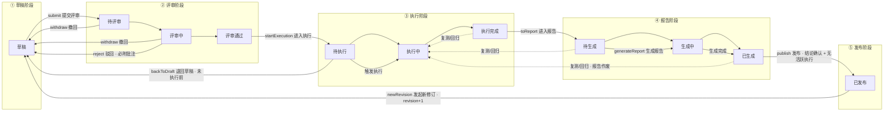
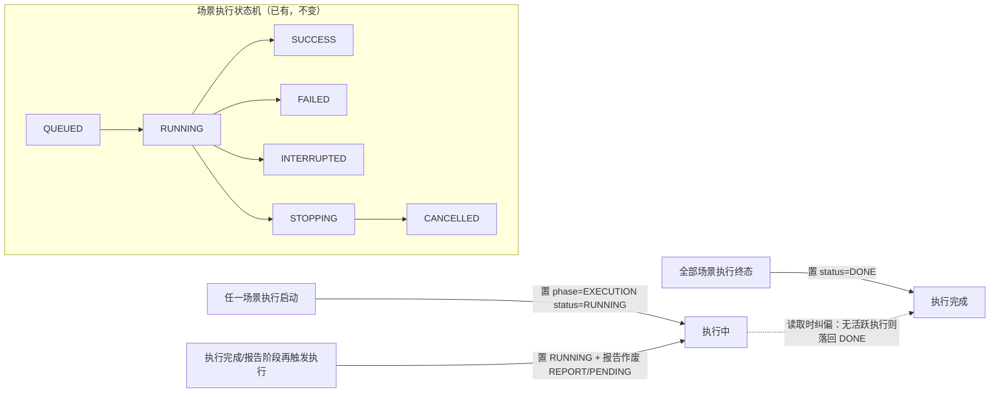

# P0-1 计划文档模块重构 —— 详细设计

> 日期：2026-09-02（修订 2：基于需求访谈定稿，见附录 B）
> 来源：`docs/architecture-and-roadmap.md` P0-1 行，遵循决策 D1/D2/D3/D4/D5/D6/D11/D12；结构化模块与场景模型参照团队真实压测报告骨架（非照抄）。
> 本文档是 P0-1 的设计规格；验收口径以路线图为准，实现按此文档拆 Issue。

## 1. 目标与验收口径

**验收口径（路线图原文）**：一个计划能从草稿走到"已发布"，中间可评审、可批注、可被本地 Agent 同步修改且冲突可手工处理。

**P0-1 范围内**：

- TaskPlan 升级为压测计划文档，**一稿走到头**：同一份文档经历 计划（评审）→ 执行（回填）→ 报告（结果+结论）→ 发布（终态）
- **结构化模块**：基本信息 / 测试目的与核心指标清单 / 测试范围 / 测试资源（含环境部署信息表）/ 测试约束（入口·出口准则清单 + 环境检查开关）/ 场景设计 / 结论 + Markdown 叙述正文（D1 修订）
- **二级状态机**：阶段 = 草稿 / 评审 / 执行 / 报告 / 发布（环境检查不是状态，是计划可选项，见 §10.2）
- 评审流程：项目成员批注、**任意成员可评审通过**、驳回/撤回（D2）
- **业务化场景设计**：测试类型 + 场景目的 + 交易范围 + 测试方法 + 场景设置（用户数/时长/加载方式/退出方式），自动翻译 JMeter 线程组；**脚本不进计划文档、不参与评审，评审通过后编写并关联**（§3.4）
- 模板体系（内置 + 项目自定义，D3）、执行摘要自动回填（D4）、revision 冲突三选一（D5）、发布终态 + 快照（D11 预埋）+ 只读分享链接（D2）

**P0-1 范围外（由后续任务承接，见 §16）**：

- MCP 计划工具集（P0-2）、验收标准实体与自动判等（P0-3）、环境检查 SSH 执行器（P1-1）、AI 生成脚本（P3-2）、迭代对比（P1-4）、缺陷台账/通知（P3-7/P3-8）
- 行级/锚定批注、自动合并、历史版本追溯（D5 明确不做自动覆盖与行级合并，历史追溯未要求）

## 2. 现状盘点与约束（代码事实）

> 包根：`backend/src/main/java/com/yr/perftest/platform`。

| 事实 | 位置 | 对设计的影响 |
|------|------|--------------|
| `TaskPlan` 是纯字段 record，无状态、无正文 | `task/TaskPlan.java`、`task/PersistentTaskPlanRecord.java` | 状态机、正文、结构化模块全部是新增 |
| 场景创建**必填** `scriptVersionId`（`CreateScenarioRequest`） | `api/TaskPlanController.java:290` | 脚本后置关联要求改为**可空、后期绑定**（§3.4） |
| 计划-场景-执行经 `scenarioId` 关联 | `task/ScenarioExecution.java` | 执行摘要回填按 planId 聚合已有现成查询 |
| 执行状态机 `QUEUED→RUNNING→SUCCESS/FAILED/INTERRUPTED` | `execution/ExecutionStatus.java` | 计划"执行中/执行完成"由执行生命周期事件驱动（§4.4） |
| 执行启停唯一 seam 是 `ExecutionControlService.start`，**已含预检**（`ExecutionPrecheckService`） | `task/ExecutionControlService.java`、`task/ExecutionPrecheckService.java`（CONTEXT.md C1） | 执行门禁与环境检查首执行触发**都挂这条 seam**，不新建执行路径 |
| 快捷执行：前端"脚本列表 → 执行"串三步建计划+场景+执行 | `frontend/src/composables/useTaskPlans.ts:409` | 改造为服务端合并端点（§10.4） |
| Bearer token → SecurityContext `HumanPrincipal` | `config/AuthenticationFilter.java:42` | 新端点取 SecurityContext 身份，不信任 `X-User` 头 |
| 项目成员模型存在但未在计划接口强制 | `project/PersistentProjectRecord.java:30`、`PersistentProjectMemberRecord.java` | 需新增访问判定层（§13） |
| 回填数据源现成：`ExecutionSummary`、`ReportDataService.aggregateByPlan` | `facade/data/ExecutionSummary.java`、`report/ReportDataService.java:59` | 回填与报告生成直接复用 |
| 无 `@Version` 先例；seed 模块有手工版本计数先例 | `seed/PersistentSeedCaptureStrategyRecord.java:50` | revision 用普通 INT 列 + 应用层比对 |
| 无 Flyway/Liquibase，`ddl-auto: update` + 手写 schema 文件 | `application.yml:8-10` | 新列新表同时改实体与 `docs/database/mysql-schema.sql` |
| 前端无 Markdown 编辑器；ant-design-vue 4 + Vue 3.5 | `frontend/package.json` | 引入 `md-editor-v3`（§14.5） |
| 测试风格：JUnit 5 `@SpringBootTest` 集成 + MockMvc | `backend/src/test/java/.../task/` | 按两种风格补测试（§17） |
| 无任何 review/comment/revision 域概念（grep 确认） | — | 批注、状态机均为绿地 |

## 3. 领域模型

### 3.1 计划文档 = 一份 Markdown 原文（一稿走到头）

**Markdown 原文（`body`）是压测计划的唯一数据源**，完整章节按固定顺序排列：

```
body（Markdown 原文，唯一数据源；全部章节统一中文序号）
├─ 一、背景                    叙述（自由，仅原文）
├─ 二、测试目的与指标           受约束章节：段落 + 表格 [交易|指标|目标值|口径]
├─ 三、测试范围                 受约束章节：范围内表格 [交易名称|交易配比|备注] + 范围外清单
├─ 四、测试资源                 受约束章节：人员 / 环境部署信息表格 [地址|模块|配置/版本] / 执行节点·监控目标·时间窗口
├─ 五、测试约束                 受约束章节：入口准则清单 / 出口准则清单（`- [x] 条目（自动/人工）`）
├─ 六、测试策略                 叙述（自由，仅原文）
├─ 七、场景设计                 受约束章节：每场景 `### S{n} 名称 · 测试类型` + 场景目的 + 场景设置表格（用户数/时长/加载方式/退出方式）+ **执行记录回填块（§8）**
├─ 八、风险与预案               叙述（自由，仅原文）
├─ 九、排期与协作               受约束章节：表格 [环节|时间|负责人]
├─ 十、附录                     叙述（自由，仅原文）
└─ 十一、结论                   原文章节（暂不提取）：达成表 [指标|目标|实际结果|状态] + 风险与建议 + 总体结论（发布时人工确认）
```

- **Pretty 只提取关键受约束章节**（默认 6 个，后续可按需添加）：**二、测试目的与指标 / 三、测试范围 / 四、测试资源 / 五、测试约束 / 七、场景设计 / 九、排期与协作**。叙述章节（背景 / 策略 / 风险 / 附录 / 结论）**只在 Markdown 原文中，Pretty 不展示**——Pretty 是"关键信息提取视图"，不是原文的翻版。

- **Pretty（格式化展示）= 从 Markdown 原文中提取关键受约束章节做格式化展示**：解析器按章节标题与表格结构提取（指标表格、范围、资源、约束清单、场景设置、排期表），以表单/表格呈现；**受约束章节的编辑写回原文对应区块**（章节级替换），格式约束即解析约定（标题 + 表格列固定）。
- **Markdown = 压测计划原文**：预览即原文渲染；编辑即编辑原文（`md-editor-v3`）。
- **视图切换为分段控件 `Pretty | Markdown`**（不是 Tab）；Markdown 默认预览，工具栏「编辑」按钮切换编辑模式，保存返回预览。文档带**章节导航**（§14.1）。
- **不建结构化 JSON 列**：指标/范围/资源/约束/结论均以 Markdown 表格/清单存于原文，Pretty 提取展示、编辑回写原文（§11）。
- **场景是文档章节 + 执行配置实体并存**：文档章节承载业务内容（评审阅读）；`task_scenarios` 实体承载执行配置（脚本绑定、翻译后的线程组，§3.4）。场景章节由实体渲染生成并随实体变更回写；文档视图不展示脚本。
- "验收标准实体"属 P0-3：P0-3 判等引擎从原文指标章节解析阈值（或引入实体时以文档为准同步），P0-1 不建结构化列。
- **环境检查不是文档内容**：测试前的执行动作（计划执行设置），不进原文、不参与评审、不参与 revision（§10.2）。

### 3.2 新增实体

| 实体 | 职责 | 表 |
|------|------|-----|
| `PlanComment` | 评审批注 + 系统流转记录 | `plan_comments` |
| `PlanTemplate` | 计划模板（内置 + 项目自定义） | `plan_templates` |
| `PlanPublishSnapshot` | 发布时固化的文档+场景+结果摘要快照（P1-4 消费） | `plan_publish_snapshots` |
| `PlanShareToken` | 已发布计划的只读分享链接 | `plan_share_tokens` |

### 3.3 新增服务与包结构

P0-1 不拆 Maven 模块（模块拆分是路线图 §7 的并行轨道），新类放 `task/plandoc` 子包：

- `task/plandoc/PlanPhase.java` / `PlanStatus.java` — 二级状态枚举
- `task/plandoc/PlanDocumentService.java` — 文档读写（结构化模块 + 正文）、revision 冲突、回填追加
- `task/plandoc/PlanWorkflowService.java` — 状态机流转、批注、报告阶段、发布快照、分享链接、模板 CRUD
- `task/plandoc/PlanAccess.java`（+ `project/ProjectAccessResolver.java`）— 权限判定
- `task/plandoc/PlanValidationException.java` / `PlanStateException.java` / `PlanRevisionConflictException.java`
- `task/ExecutionLifecycleEvent.java` + `task/plandoc/PlanExecutionLifecycleListener.java` — 执行启停驱动计划状态 + 执行完成回填
- `api/PlanDocumentController.java` — 新 REST 面

环境检查复用既有 `ExecutionPrecheckService` seam（§10.2），不新建执行路径。P0-2 的 MCP 工具直接调用 domain service。

### 3.4 业务化场景设计

**测试类型 `testType`**（新列）：`BENCHMARK 基准 / SINGLE_TXN 单交易并发 / COMPOSITE 组合交易 / STABILITY 稳定性`。

**场景内容**：测试类型 + 场景目的（`purpose` 新列）+ 交易范围 + 测试方法叙述 + **场景设置**（业务语言）。

**场景设置 ↔ JMeter 线程组的翻译规则**（业务字段是展示与编辑语言，存储仍走现有 `threadGroupConfigs`，评审与翻译互不干扰）：

| 业务字段 | 含义 | 对应 JMeter 线程组参数 |
|----------|------|----------------------|
| 用户数 | 该交易并发用户数 | `threads` |
| 持续时长 | 本档压测时长（报告中的"迭代次数/5分钟"） | `duration`（秒） |
| 加载方式 | 同时加载 / 匀速加载 N 秒 | `rampUp`（0 = 同时加载，N = 匀速） |
| 退出方式 | 同时退出（当前平台固定语义） | 线程组停止策略（固定，不暴露） |

- 组合/稳定性场景：每交易一行设置（用户数/时长/加载方式/退出方式），对应现有按 step 拆分的 `threadGroupConfigs` 多档。
- 场景设置支持多档（30→50→80 用户梯度），档位表即现有预设行。
- 高级面板保留 threads/rampUp/duration 微调入口，业务字段由预设推导，两处同源不双写。

**脚本不进文档**：

- 计划文档视图（含评审视图）**不展示脚本名/脚本版本**；评审不审脚本。
- 脚本生命周期：**评审通过后**，测试人员基于计划手动编写脚本（AI 生成是 P3-2），通过"关联脚本"动作绑定到场景；`task_scenarios.script_version_id` 改为**可空**，创建场景时不再必填。
- 执行前置校验：场景必须已关联脚本（复用现有执行预检 seam）；入口准则清单含自动核验项"脚本已关联"（§10.2）。

## 4. 二级状态机（D2 修订）

### 4.1 阶段与子状态

| 阶段 `phase` | 子状态 `status` | 含义 |
|--------------|----------------|------|
| 草稿 DRAFT | 草稿 DRAFT | 自由编辑，唯一可改文档的阶段 |
| 评审 REVIEW | 待评审 PENDING | 已提交，等待评审人开始 |
| | 评审中 IN_REVIEW | 评审人批注中 |
| | 评审通过 APPROVED | 评审结论通过（休息态，等待进入执行） |
| 执行 EXECUTION | 待执行 PENDING | 已进入执行阶段，尚未有执行（本修订） |
| | 执行中 RUNNING | 至少一个场景执行活跃 |
| | 执行完成 DONE | 本轮全部执行结束（休息态，可复测/进入报告） |
| 报告 REPORT | 待生成 PENDING | 已进入报告阶段，等待生成 |
| | 生成中 GENERATING | 聚合生成中（瞬态） |
| | 已生成 DONE | 达成表与结论就绪，发布前人工确认 |
| 发布 PUBLISH | 已发布 PUBLISHED | 终态：快照固化、内容冻结 |

环境检查**不是状态**：它是计划的可选项，在首次执行触发时于执行 seam 内运行（§10.2）。

### 4.2 完整流转图



### 4.3 执行阶段与场景执行状态机的联动（事件驱动）



- 事件由 `ExecutionControlService.start`（启动）与执行终态写入路径（结束）发布，`PlanExecutionLifecycleListener` 落状态。
- 惰性纠偏：读取计划时若 `EXECUTION/RUNNING` 但实际无活跃执行 → 校正为 `EXECUTION/DONE`，反之亦然。
- 任何新执行启动都会把报告阶段重置为 `REPORT/PENDING`（作废旧报告，保证发布前报告反映最新执行）。

### 4.4 转移动作与权限

| 动作 | 前置 | 后置 | 允许者 | 附注 |
|------|------|------|--------|------|
| `submit` 提交评审 | DRAFT/DRAFT | REVIEW/PENDING | 负责人 / 项目 OWNER / 系统 ADMIN | |
| `startReview` 开始评审 | REVIEW/PENDING | REVIEW/IN_REVIEW | 项目成员 | 记录系统批注 |
| `approve` 评审通过 | REVIEW/IN_REVIEW | REVIEW/APPROVED | **任意项目成员** | 记录审批人；自审允许 |
| `reject` 驳回 | REVIEW/IN_REVIEW | DRAFT/DRAFT | 项目成员 | **必须附批注** |
| `withdraw` 撤回 | REVIEW/PENDING、REVIEW/IN_REVIEW | DRAFT/DRAFT | 负责人 / 项目 OWNER / 系统 ADMIN | |
| `backToDraft` 退回草稿 | REVIEW/APPROVED、EXECUTION/PENDING | DRAFT/DRAFT | 负责人 / 项目 OWNER / 系统 ADMIN | 仅本修订未产生执行时 |
| `startExecution` 进入执行 | REVIEW/APPROVED | EXECUTION/PENDING | 项目成员 | 评审与执行的分界点；**入口准则不设硬门禁** |
| 触发执行（含复测） | EXECUTION/PENDING、EXECUTION/DONE、REPORT/PENDING、REPORT/DONE | EXECUTION/RUNNING | 项目成员 | 场景须已关联脚本；首执行时按可选项跑环境检查（§10.2） |
| 执行全部结束 | EXECUTION/RUNNING | EXECUTION/DONE | 系统（事件） | |
| `toReport` 进入报告 | EXECUTION/DONE | REPORT/PENDING | 项目成员 | |
| `generateReport` 生成报告 | REPORT/PENDING、REPORT/DONE | REPORT/GENERATING → REPORT/DONE | 项目成员 | 复用 `ReportDataService` 聚合；P0-3 起附判等回填达成表 |
| `publish` 发布 | REPORT/DONE 且无活跃执行 | PUBLISH/PUBLISHED | 负责人 / 项目 OWNER / 系统 ADMIN | 发布请求须携带总体结论（人工确认）；生成发布快照 |
| `newRevision` 发起新修订 | PUBLISH/PUBLISHED | DRAFT/DRAFT | 负责人 / 项目 OWNER / 系统 ADMIN | `revision+1`；旧发布快照保留；`precheck_executed_at` 重置 |

### 4.5 编辑与状态的关系

- **文档编辑（结构化模块 + 正文）仅允许在 DRAFT 阶段**。评审中改：撤回；评审通过/待执行（未执行）改：退回草稿。执行开始后至发布前文档不可改；发布后走 `newRevision`。
- 默认执行配置（老 `PUT /api/task-plans/{id}`）：仅 DRAFT 可改。
- 场景增删改：允许于 DRAFT / REVIEW / EXECUTION（除 RUNNING）/ REPORT；`EXECUTION/RUNNING` 与 `PUBLISH/PUBLISHED` 禁止。
- **关联脚本**：允许于评审通过后的执行/报告阶段（非 RUNNING）。
- 回填是系统写操作，不受阶段限制、不校验 baseRevision（§8.2）。

## 5. 修订与冲突处理（D5）

### 5.1 revision 语义

- `task_plans.revision`：文档修订号，从 1 起。**任何导致 Markdown 原文变化的写入 `revision+1`**——包括用户编辑（全文编辑或 Pretty 章节写回）与系统回填。
- 默认执行配置、场景实体（脚本关联/翻译线程组）、环境检查设置（执行设置）变化**不**影响 revision（冲突控制只覆盖文档原文）。

### 5.2 乐观并发控制

- 更新文档必须携带 `baseRevision`；服务端事务内比对不一致 → **409 `PLAN_REVISION_CONFLICT`**：

```json
{
  "code": "PLAN_REVISION_CONFLICT",
  "message": "计划文档已被修改（当前 revision=5，提交基于 revision=4）",
  "currentRevision": 5,
  "serverMarkdown": "（服务器当前完整 Markdown 原文）"
}
```

- 服务端**不落盘**请求方提交的内容，只返回当前服务器版本。不做自动覆盖、不做行级合并（D5）。

### 5.3 三选一冲突解决（UI 与本地 Agent 通用）

1. **保留平台版**：放弃本地修改，重新读取服务器版本继续工作。
2. **采纳本地版**：以 `currentRevision` 为新 base，重放本地全部内容（整文档覆盖，非行级合并）。
3. **手改**：以服务器版本为基底打开编辑器，人工合并后再以 `currentRevision` 提交。

MCP（P0-2）与 REST 共用同一语义；"差异文本"由双方各自持有两版全文实现（D5）。

### 5.4 双栏差异展示

- 前端冲突弹窗左右并排"平台当前版" vs "本地版"：整篇 Markdown 行级 diff 高亮（§14.3）。

## 6. 评审与批注（D2）

### 6.1 批注模型

`plan_comments`：`id / planId / author / content / kind / createdAt`。

- `kind = REVIEW`：评审批注，项目成员在草稿/评审阶段可发；进入执行后评审批注只读。
- `kind = SYSTEM`：流转记录（提交评审/开始评审/通过/驳回/撤回/进入执行/环境检查运行与跳过/进入报告/生成报告/发布/发起新修订/快捷执行自动通过/执行摘要回填），服务写入，不可编辑删除。
- **全文档级批注，不做行锚定**（Markdown 行号随编辑漂移，D5 不做行级合并）。
- `PUBLISH/PUBLISHED`：批注全部只读。

### 6.2 批注权限

- 新增批注：项目成员（含负责人），仅限草稿/评审阶段。
- 删除批注：作者本人 / 负责人 / 项目 OWNER / 系统 ADMIN；`SYSTEM` 批注不可删。

## 7. 模板体系（D3）

### 7.1 数据模型

`plan_templates`：`id / projectId(null=内置) / name / description / content(Markdown) / builtin / createdBy / createdAt / updatedAt`。

- 内置模板：seed 于启动（存在即跳过），不可编辑删除。
- 项目自定义模板：项目 OWNER / 系统 ADMIN 增删改，项目成员查看使用。

### 7.2 占位符与渲染

- 占位符 `{{name}}`，P0-1 支持 `{{planName}}`，机制可扩展。
- 模板 = **完整 Markdown 文档模板**（章节顺序：一、背景 → 二、测试目的与指标 → 三、测试范围 → 四、测试资源 → 五、测试约束 → 六、测试策略 → 七、场景设计 → 八、风险与预案 → 九、排期与协作 → 十、附录 → 十一、结论），6 个受约束章节含固定表格头/清单结构，场景块预留 `#### 执行记录` 回填位；`{{planName}}` 等占位符在创建时替换。
- 首版内置模板一份："通用压测计划"。

## 8. 自动回填（D4）

### 8.1 机制

- **不设独立的"执行记录"章节**：执行摘要直接回填到**场景设计章节（七、场景设计）中对应场景块**的 `#### 执行记录` 小标题下——执行历史跟着场景走，Pretty 场景表格的"最新执行"列与明细卡直接读该块。
- 与状态维护共用 `ExecutionLifecycleEvent`；执行进入终态时向对应场景块追加条目，幂等靠 `<!-- backfill:execution:<executionId> -->` 标记（场景块内查重，存在即跳过）。
- 条目模板（确定性拼接，不调用 LLM）：

```markdown
<!-- backfill:execution:123 -->
#### 执行记录
- 2026-09-02 14:30 · 梯度 200 并发 · SUCCESS · 吞吐 158.3 TPS · P95 96 ms · 错误率 0.42%
```

- 数据来自 `ExecutionSummary`。环境检查结果（P1-1）、缺陷清单（P3-7）回填走同一追加机制（P0-1 只交付机制 + 执行摘要一个源）。

### 8.2 回填与 revision

回填是系统写入：不校验 baseRevision、不受阶段限制，但 **`revision+1`**。本地 Agent 持旧 revision 提交收 409 → 重新读取 → 保留自己修改以新 base 提交（现有冲突流程，无特殊处理）。

### 8.3 结论章节与报告（一稿走到头）

- 结论章节组成：**指标达成表**（指标/目标/实际/状态）+ **风险与建议** + **总体结论**。
- P0-1：达成表为占位结构（生成报告时聚合摘要先行填充"实际"列，判等状态 P0-3 起）；总体结论在**发布时由发布人填写/确认**。
- P0-3 起：判等自动回填达成表"状态"列并预填总体结论，发布前人工确认（D4 半自动）。

## 9. 发布终态、快照与分享（D2/D11）

### 9.1 发布动作

`publish`（REPORT/DONE → PUBLISH/PUBLISHED）：

1. 校验无活跃执行（有则 409）。
2. 校验请求携带总体结论（发布人确认；为空则 400）。
3. 生成发布快照（§9.2）。
4. 置 `phase=PUBLISH, status=PUBLISHED, publishedAt=now`，写系统批注"已发布（revision=N）"。
5. 发布后：文档、默认配置、场景均冻结；继续执行与报告生成不受影响；变更走 `newRevision`。

### 9.2 发布快照（D11 预埋）

`plan_publish_snapshots`：`id / planId / revision / publishedBy / publishedAt / docJson / scenarioJson / summaryJson`，`unique(planId, revision)`。

- `docJson`：发布时的 Markdown 原文全文。
- `scenarioJson`：场景列表（测试类型/场景设置/脚本版本——快照是内部数据，不违反"文档不展示脚本"）。
- `summaryJson`：各场景最近一次成功执行的结果摘要（复用 `ReportDataService`/`ExecutionQueryService`）。
- P1-4 迭代对比直接消费最近两个快照。

### 9.3 只读分享链接

- `plan_share_tokens`：`id / planId / token(UUID) / expiresAt / revokedAt / createdBy / createdAt`。
- 创建：仅已发布计划，负责人 / 项目 OWNER / 系统 ADMIN，可选有效期（默认 30 天）；撤销置 `revokedAt`，过期/撤销访问 404。
- 公开读取：`GET /api/share/plans/{token}`（SecurityConfiguration 放行 `/api/share/**`），返回结构化模块 + 正文 + 发布时间；不返回场景执行明细、批注与快照。

## 10. 执行门禁、环境检查与快捷执行

### 10.1 执行门禁（唯一 seam）

`ExecutionControlService.start` 在现有校验后追加：

1. 计划须处于 `EXECUTION` 或 `REPORT` 阶段（评审已通过），否则 409 `PLAN_STATE`（附"请先通过评审并进入执行阶段"）。
2. 场景须已关联脚本（`script_version_id` 非空）。
3. 允许触发的前置子状态：`EXECUTION/PENDING、EXECUTION/DONE、REPORT/PENDING、REPORT/DONE`（复测/回归）；`EXECUTION/RUNNING` 按现有并发限制处理。

影响面：计划/场景执行按钮、agent 面 `StartExecutionTool` 统一走此 seam；未通过评审不可执行（P0 闭环的刻意收紧）。

### 10.2 环境检查（执行前动作，非文档内容）

- **定位**：环境检查是**测试前的一个执行动作**——配置挂在计划的**执行设置**里（独立于文档），不进文档模块、不参与评审、不参与 revision 冲突、不影响快照一致性。
- 配置：`precheck_json`（启用开关 + 检测清单，默认取入口准则中的环境类条目，可增删），通过独立接口维护（§12.1），入口在场景执行触发流程与计划设置抽屉。
- 触发时机：**评审通过后的首次执行触发时**（`precheck_executed_at` 为空则运行），复用现有 `ExecutionPrecheckService` seam——在 start 前执行清单校验，不新建执行路径。
- 结果自动勾选回入口准则清单（入口准则属文档，核验结果回填其上）；"环境就绪"等真实探测项由 P1-1 执行器填充。
- **可手动跳过**：检查存在未通过项时，执行暂停并提示；用户可"跳过检查继续执行"（记系统批注留痕），或手动触发预检重跑。
- 复测/回归不自动重跑（`precheck_executed_at` 已置）；执行前可手动触发预检。`newRevision` 重置 `precheck_executed_at`。

### 10.3 入口准则自动核验项

| 条目 | P0-1 核验方式 |
|------|--------------|
| 指标已定义 | 自动（核心指标清单非空） |
| 场景已配置 | 自动（存在场景） |
| 脚本已关联 | 自动（全部场景脚本非空） |
| 环境就绪 / 数据就绪 / 人员到位 / 接口人明确 | 人工勾选；"环境就绪"等 P1-1 后自动 |

### 10.4 快捷执行改造

`POST /api/scripts/{scriptVersionId}/quick-execute`：服务端事务内 建计划（`EXECUTION/PENDING`）→ 系统批注"快捷执行自动通过评审" → 建场景（携带脚本）→ 走 `ExecutionControlService.start` 触发 → 返回 executionId。环境检查默认不启用。前端 `runScriptAsset` 改调此端点；普通创建计划一律草稿，不提供绕过评审的参数。

## 11. 数据模型 DDL

### 11.1 task_plans 新增列

```sql
ALTER TABLE task_plans
  ADD COLUMN phase                VARCHAR(20)  NOT NULL DEFAULT 'DRAFT',
  ADD COLUMN status               VARCHAR(20)  NOT NULL DEFAULT 'DRAFT',
  ADD COLUMN body                 LONGTEXT     NULL,  -- Markdown 原文（唯一数据源，含全部章节）
  ADD COLUMN revision             INT          NOT NULL DEFAULT 1,
  ADD COLUMN published_at         DATETIME     NULL,
  ADD COLUMN precheck_json        LONGTEXT     NULL,  -- 执行设置（非文档内容）：{enabled, items:[]}
  ADD COLUMN precheck_executed_at DATETIME     NULL;
```

存量行迁移：`DRAFT/DRAFT`、`revision=1`、模块与正文 null，无数据订正需求（无生产数据）。

### 11.2 task_scenarios 变更

```sql
ALTER TABLE task_scenarios
  MODIFY COLUMN script_version_id BIGINT NULL,      -- 脚本后置关联，创建时可空
  ADD COLUMN purpose    TEXT        NULL,            -- 场景目的
  ADD COLUMN test_type  VARCHAR(20) NULL;            -- BENCHMARK/SINGLE_TXN/COMPOSITE/STABILITY
```

- 既有 `CreateScenarioRequest.scriptVersionId` 改为可选；新增"关联脚本"动作（§12.2）。
- 场景设置业务字段（用户数/时长/加载方式/退出方式）由现有 `threadGroupConfigs` 推导展示，不新增存储（§3.4 翻译规则）。

### 11.3 新表

```sql
CREATE TABLE plan_comments (
  id         BIGINT AUTO_INCREMENT PRIMARY KEY,
  plan_id    BIGINT      NOT NULL,
  author     VARCHAR(80) NOT NULL,
  content    TEXT        NOT NULL,
  kind       VARCHAR(20) NOT NULL,            -- REVIEW / SYSTEM
  created_at DATETIME    NOT NULL,
  KEY idx_plan_comments_plan (plan_id, id)
);

CREATE TABLE plan_templates (
  id          BIGINT AUTO_INCREMENT PRIMARY KEY,
  project_id  BIGINT       NULL,              -- NULL = 内置
  name        VARCHAR(160) NOT NULL,
  description VARCHAR(1000) NULL,
  content     LONGTEXT     NOT NULL,
  builtin     TINYINT(1)   NOT NULL DEFAULT 0,
  created_by  VARCHAR(80)  NOT NULL,
  created_at  DATETIME     NOT NULL,
  updated_at  DATETIME     NOT NULL,
  KEY idx_plan_templates_project (project_id)
);

CREATE TABLE plan_publish_snapshots (
  id            BIGINT AUTO_INCREMENT PRIMARY KEY,
  plan_id       BIGINT      NOT NULL,
  revision      INT         NOT NULL,
  published_by  VARCHAR(80) NOT NULL,
  published_at  DATETIME    NOT NULL,
  doc_json      LONGTEXT    NOT NULL,
  scenario_json LONGTEXT    NOT NULL,
  summary_json  LONGTEXT    NULL,
  UNIQUE KEY uk_plan_snapshot (plan_id, revision)
);

CREATE TABLE plan_share_tokens (
  id         BIGINT AUTO_INCREMENT PRIMARY KEY,
  plan_id    BIGINT      NOT NULL,
  token      VARCHAR(64) NOT NULL,
  expires_at DATETIME    NULL,
  revoked_at DATETIME    NULL,
  created_by VARCHAR(80) NOT NULL,
  created_at DATETIME    NOT NULL,
  UNIQUE KEY uk_share_token (token),
  KEY idx_share_plan (plan_id)
);
```

- 同步更新 `docs/database/mysql-schema.sql`；开发态依赖 `ddl-auto: update`（H2 兼容，P0-4 负责 MySQL 正式迁移）。
- `TaskPlanService.deletePlan` 级联清理 comments/snapshots/share tokens。

## 12. REST API 设计

新端点统一挂 `api/PlanDocumentController`（认证取 SecurityContext `HumanPrincipal`，不信任 `X-User` 头；未登录 401）。

### 12.1 计划文档与流转

| 方法 | 路径 | 说明 |
|------|------|------|
| GET | `/api/task-plans/{id}` | 响应含 `phase/status/goals/scope/resources/criteria/conclusion/body/revision/precheck 状态/publishedAt`；`owner` 即 `createdBy` |
| PUT | `/api/task-plans/{id}/document` | `{baseRevision, markdown}`（**整篇原文**；Pretty 章节编辑由前端合并回原文后整体提交）；200 新原文 / 409 冲突；仅 DRAFT |
| POST | `/api/task-plans/{id}/submit` | 草稿 → 评审·待评审；可选 `{comment}` |
| POST | `/api/task-plans/{id}/start-review` | 评审·待评审 → 评审中 |
| POST | `/api/task-plans/{id}/approve` | 评审中 → 评审通过；可选 `{comment}` |
| POST | `/api/task-plans/{id}/reject` | 评审中 → 草稿；`{comment}` 必填 |
| POST | `/api/task-plans/{id}/withdraw` | 评审·待评审/评审中 → 草稿 |
| POST | `/api/task-plans/{id}/back-to-draft` | 评审通过/执行·待执行 → 草稿（未执行前） |
| POST | `/api/task-plans/{id}/start-execution` | 评审通过 → 执行·待执行 |
| POST | `/api/task-plans/{id}/to-report` | 执行完成 → 报告·待生成 |
| POST | `/api/task-plans/{id}/generate-report` | 报告·待生成/已生成 → 生成中 → 已生成 |
| POST | `/api/task-plans/{id}/publish` | 报告·已生成 → 发布·已发布；`{conclusion}` 必填；有活跃执行/非报告已生成 409 |
| POST | `/api/task-plans/{id}/new-revision` | 发布·已发布 → 草稿，revision+1，重置 precheck 标记 |
| POST | `/api/task-plans/{id}/precheck-run` | 手动触发环境检查（复用执行预检 seam） |
| POST | `/api/task-plans/{id}/precheck-skip` | 跳过检查继续执行（记系统批注） |
| PUT | `/api/task-plans/{id}/precheck-settings` | 环境检查执行设置（启用 + 检测清单）；非文档内容，不进 revision |
| PUT | `/api/task-plans/{id}` | 老端点（默认配置）保留；仅 DRAFT 可改 |
| DELETE | `/api/task-plans/{id}` | 负责人/OWNER/ADMIN；级联新表 |
| POST | `/api/projects/{projectId}/task-plans` | 创建扩展：可选 `{templateId, goals, scope, resources, criteria}`，模板渲染正文 |

### 12.2 场景 / 批注 / 模板 / 分享 / 快捷执行

| 方法 | 路径 | 说明 |
|------|------|------|
| POST | `/api/scenarios/{scenarioId}/script` | **关联脚本** `{scriptVersionId}`；评审通过后（非 RUNNING） |
| PUT | `/api/scenarios/{scenarioId}` | 场景字段扩展：`purpose/testType/threadGroupConfigs`；`scriptVersionId` 可选 |
| GET/POST | `/api/task-plans/{id}/comments` | 批注列表 / 新增（REVIEW） |
| DELETE | `/api/task-plans/{id}/comments/{commentId}` | 权限见 §6.2 |
| GET | `/api/projects/{projectId}/plan-templates` | 内置 + 项目自定义 |
| POST/PUT/DELETE | `/api/projects/{projectId}/plan-templates[/{id}]` | 仅项目自定义；OWNER/ADMIN |
| POST | `/api/task-plans/{id}/shares` | `{expiresInDays?}`；仅已发布 |
| GET/DELETE | `/api/task-plans/{id}/shares[/{tokenId}]` | 列表 / 撤销 |
| GET | `/api/share/plans/{token}` | 公开只读（放行白名单） |
| POST | `/api/scripts/{scriptVersionId}/quick-execute` | §10.4 |

### 12.3 响应通用约定

- 每个计划读取响应附带 `permissions`（`EDIT/SUBMIT/START_REVIEW/APPROVE/REJECT/WITHDRAW/BACK_TO_DRAFT/START_EXECUTION/TO_REPORT/GENERATE_REPORT/PUBLISH/NEW_REVISION/PRECHECK_RUN/PRECHECK_SKIP/DELETE/COMMENT/SHARE`），前端按钮显隐以此为准。
- 状态非法 → 409 `PLAN_STATE`（附当前 phase/status 与允许动作）；权限不足 403；不存在 404。

## 13. 权限模型

### 13.1 角色解析（`ProjectAccessResolver`）

1. 系统 `SystemRole.ADMIN` → 全权。
2. `project.ownerUsername == username` 或 `project_members.role == OWNER` → **项目 OWNER**。
3. `project_members` 存在 → **项目成员**。
4. 计划 `createdBy == username` → **计划负责人**（以成员身份为前提）。
5. 其它 → 403。

### 13.2 动作矩阵

| 动作 | 成员 | 负责人 | 项目 OWNER | 系统 ADMIN |
|------|:--:|:--:|:--:|:--:|
| 读计划/批注 | ✅ | ✅ | ✅ | ✅ |
| 编辑文档（草稿） | ❌ | ✅ | ✅ | ✅ |
| 改默认配置（草稿） | ❌ | ✅ | ✅ | ✅ |
| 场景增删改（非执行中/未发布） | ✅ | ✅ | ✅ | ✅ |
| **关联脚本（评审通过后）** | ✅ | ✅ | ✅ | ✅ |
| submit / withdraw / backToDraft | ❌ | ✅ | ✅ | ✅ |
| startReview / 批注 | ✅ | ✅ | ✅ | ✅ |
| approve / reject | ✅ | ✅ | ✅ | ✅ |
| startExecution / toReport / generateReport | ✅ | ✅ | ✅ | ✅ |
| 触发执行（含复测）/ precheck-run / precheck-skip | ✅ | ✅ | ✅ | ✅ |
| publish / newRevision / 分享创建撤销 | ❌ | ✅ | ✅ | ✅ |
| 删除计划 | ❌ | ✅ | ✅ | ✅ |
| 模板管理（增删改） | ❌ | ❌ | ✅ | ✅ |
| 快捷执行 | ✅ | ✅ | ✅ | ✅ |

说明：approve 允许任意项目成员（含自审）——最终放行靠发布权限兜底。执行阶段动作对成员开放——评审已通过，执行是团队协作行为。MCP 白名单（D12）在 P0-2 落地：publish 终态、删除类、分享创建不进 MCP。

## 14. 前端设计

### 14.1 计划详情页重构（`TaskPlanDetail.vue`）

**Tab 结构**：文档 / 评审 / 报告 / 发布（沿用现有项目壳路由 `/projects/:projectId/task-plans/:planId`）。场景不是独立 Tab——**场景设计是文档的一个结构化模块**。

- **阶段步进条**：草稿 → 评审 → 执行 → 报告 → 发布 五节点，当前阶段高亮，节点下显示子状态；历史阶段 ✓。
- **文档 Tab**（核心）：
  - **视图切换（分段控件 `Pretty | Markdown`，非 Tab）**：
    - `Pretty`：**只展示从原文提取的关键受约束章节**（默认 6 个：二、测试目的与指标 / 三、测试范围 / 四、测试资源 / 五、测试约束 / 七、场景设计 / 九、排期与协作），以受约束表单呈现（格式约束、快速编辑，写回原文对应区块）；**叙述章节（背景/策略/风险/附录/结论）不在 Pretty 展示**，仅在 Markdown 原文中。**不含环境检查**（执行设置，见下）。
    - `Markdown`：整份文档的 Markdown 连续渲染（模块章节由确定性渲染器生成，不落库不双写）；**默认预览**；工具栏「编辑」按钮切换为编辑模式——`md-editor-v3` 编辑叙述正文（模块章节回 Pretty 表单编辑），保存携带 baseRevision，返回预览。
  - **章节导航（TOC）**：文档区左侧锚点导航，列出全部章节（模块章节 + 正文标题），点击滚动定位，Pretty 与 Markdown 两个视图共用。
  - 保存携带 baseRevision，409 弹冲突框（§14.3）。
  - 环境检查：**不在文档中体现**——配置入口在"执行设置"抽屉（或执行触发弹窗），展示为执行前动作（启用/清单/首执行状态/跳过）。
- **评审 Tab**：批注时间线（REVIEW + SYSTEM）、流转动作（开始评审/通过/驳回/撤回）。
- **报告 Tab**：报告阶段状态、生成报告按钮、达成表（实际列聚合先行、状态列 P0-3）、发布前置条件清单。
- **发布 Tab**：发布按钮 + 总体结论确认输入、发布快照列表、分享链接管理。

### 14.2 计划列表（`TaskPlanList.vue`）

阶段/子状态 badge（如"执行·执行中"）、负责人列；行内动作随权限过滤。

### 14.3 冲突三选一弹窗

左右双栏"平台当前版" vs "本地版"：整篇 Markdown 行级 diff 高亮；三按钮：**保留平台版 / 采纳本地版 / 手改**；行级 diff 用 `jsdiff` 自绘。

### 14.4 分享公开页

`/share/plans/:token`：结构化模块 + Markdown 只读渲染，无需登录。

### 14.5 依赖与其它

- 引入 `md-editor-v3`（计划文档编辑与模板编辑共用）+ `jsdiff`（冲突 diff）。
- `TaskPlanDialog` 创建弹窗：模板选择 + 结构化模块初始输入；创建即草稿。
- 快捷执行按钮改调 `/api/scripts/{scriptVersionId}/quick-execute`。
- 新增 `frontend/src/api/plan-doc.ts` 与类型扩展。

## 15. 错误处理

| 异常 | HTTP | code | 说明 |
|------|------|------|------|
| `PlanStateException` | 409 | `PLAN_STATE` | 状态非法，附当前 phase/status + 允许动作 |
| `PlanRevisionConflictException` | 409 | `PLAN_REVISION_CONFLICT` | §5.2 响应体 |
| `PlanAccessDeniedException` | 403 | `PLAN_ACCESS_DENIED` | 非项目成员/权限不足 |
| `PlanValidationException` | 400 | `PLAN_INVALID` | reject 缺批注、publish 缺结论、场景缺脚本触发执行、模块格式非法 |
| 分享过期/撤销 | 404 | `SHARE_NOT_FOUND` | 不泄露计划是否存在 |

统一走现有 `PlatformExceptionHandler` 注册。

## 16. 与其它任务的边界

| 任务 | 关系 |
|------|------|
| P0-2 MCP 工具集 | 直接调用 `PlanDocumentService`/`PlanWorkflowService`；`plan_update` 复用 409 冲突与 `baseRevision` |
| P0-3 验收判等 | 指标清单以 Markdown 表格存于原文；P0-3 判等引擎从原文"测试目的与指标"章节解析阈值（或引入验收实体时以文档为准同步），生成报告时回填结论章节达成表"状态"列并预填总体结论 |
| P1-1 环境检查 | P0-1 交**执行设置**（precheck_json：开关 + 检测清单，非文档内容）+ 首执行触发 + 跳过 + 自动核验框架（挂现有预检 seam）；P1-1 交 SSH 探测执行器，把"环境就绪"升级为自动勾 |
| P3-2 AI 生成脚本 | 脚本"评审通过后产生并关联"的流程 P0-1 已就位；AI 生成方式（OpenAPI/自然语言 → JMX）由 P3-2 提供 |
| P1-4 迭代对比 | 消费 `plan_publish_snapshots` |
| P0-4 MySQL 迁移 | 并行批次：新 DDL 进 `mysql-schema.sql`，开发 H2 靠 ddl-auto |
| 模块拆分（并行轨道） | P0-1 不拆 Maven 模块；新类放 `task/plandoc` |

## 17. 测试计划

沿用两种风格（JUnit 5 `@SpringBootTest` 集成 + MockMvc）。

**状态机与权限**：全链路 草稿→评审→执行→报告→发布→新修订 每步成功与非法转移（409）；复测/回归重置报告为待生成；执行生命周期事件置 RUNNING/DONE + 惰性纠偏；权限矩阵逐动作 403/通过；reject 缺批注、publish 缺结论 400；publish 有活跃执行/非报告已生成 409。

**环境检查（执行设置）**：启用后首执行触发自动运行（`precheck_executed_at` 空→运行→置时间戳）；复测不重跑；`precheck-skip` 留痕继续；`newRevision` 重置标记；未启用则不运行；`precheck-settings` 更新不 bump revision。

**脚本后置关联**：场景创建 scriptVersionId 可空；未关联脚本触发执行 → 400；关联脚本后执行成功；入口准则"脚本已关联"自动勾选。

**场景业务字段**：业务字段（用户数/时长/加载方式）与 `threadGroupConfigs` 推导一致（翻译规则测试）；test_type/purpose 读写。

**冲突与三选一**：同 baseRevision 成功且 revision+1；过期 base → 409 含 serverMarkdown 原文；currentRevision 重放成功；回填 bump revision 后旧 base 提交 409 → 重放成功。

**回填**：执行终态 → 追加到场景设计章节对应场景块的 `#### 执行记录` 下且幂等（场景块内查重）；不触碰该块之外的正文；场景表格"最新执行"列与明细卡从该块解析。

**发布与分享**：快照内容 = 模块+正文/场景/摘要；unique(planId, revision)；分享匿名可读、过期/撤销 404、非发布不可创建。

**门禁与快捷执行**：草稿/评审阶段触发执行 409；quick-execute 单请求完成建计划(EXECUTION/PENDING)+批注+场景(含脚本)+执行(RUNNING)；RUNNING/已发布状态场景增删改 409。

**前端**：冲突三选一交互、阶段步进条渲染、权限驱动按钮显隐、业务化场景卡片。

## 18. 关键决策清单（访谈定稿，请评审确认）

1. **一稿走到头**：同一份文档 计划 → 执行回填 → 报告 → 发布，不设独立报告文档；报告阶段生成的内容回填进同一文档的结论章节。
2. **二级状态 5 阶段**：草稿/评审/执行/报告/发布；**环境检查不是状态、也不是文档内容**——它是测试前的执行动作（计划执行设置），评审通过后首次执行时自动运行、可跳过。
3. **业务化场景模型**：测试类型 + 目的 + 交易范围 + 场景设置（用户数/时长/加载方式/退出方式）→ 自动翻译 JMeter 线程组；高级参数可微调，同源不双写。
4. **脚本不进计划文档**：不展示、不评审；评审通过后由测试人员编写（AI 生成 P3-2）并关联到场景；`scriptVersionId` 可空、后期绑定。
5. **测试约束（评审内容）**：入口/出口准则结构化清单、不设硬门禁；能自动核验的自动勾，其余人工勾；清单是 P1-1 环境检查的数据依赖。**环境检查本身不进文档**：配置在计划执行设置（precheck_json），不进评审、不进 revision。
6. **评审**：任意项目成员可评审通过（含自审，记录审批人）；发布权限 = 负责人/项目 OWNER/系统管理员。
7. **编辑冻结**：文档与默认配置仅草稿可编辑；执行开始后至发布前文档不可改；场景在非执行中/未发布可改；发布后走新修订。
8. **批注**：全文档级，仅草稿/评审阶段可发。
9. **分享链接**：仅已发布计划，默认 30 天，可撤销。
10. **回填**：系统写入（不校验 baseRevision）但 revision+1。
11. **删除收紧**：负责人/项目 OWNER/系统管理员。
12. **模板**：OWNER/ADMIN 管理，成员可用；内置 seed。
13. **新依赖**：`md-editor-v3` + `jsdiff`。
14. **Markdown 原文唯一数据源**：不建结构化 JSON 列——全部章节（统一中文序号一~十一）存于原文；受约束章节（默认 6 个：二、测试目的与指标 / 三、测试范围 / 四、测试资源 / 五、测试约束 / 七、场景设计 / 九、排期与协作，可扩展）的格式约束 = 固定标题 + 固定表格列（解析约定）。
15. **文档视图**：分段控件 `Pretty | Markdown`（非 Tab）——Pretty = **只提取关键受约束章节**做格式化展示（叙述章节不在 Pretty 出现），编辑写回原文对应区块；Markdown = **压测计划原文**（含全部章节），默认预览、「编辑」按钮切换原文编辑。执行摘要回填到场景设计章节对应场景块，场景表格"最新执行"列从该块解析。
16. **场景是文档模块**：场景设计在文档内展示与编辑，不设独立 Tab；页面 Tab = 文档/评审/报告/发布。
17. **章节导航**：文档区左侧 TOC（结构化模块章节 + 正文标题），点击滚动定位。

## 附录 A：决策依据索引

- D1 结构化模块 + Markdown 正文（2026-09-02 修订）→ §3.1；D2 二级状态机（2026-09-02 修订）→ §4；D3 模板 → §7；D4 自动回填 → §8；D5 冲突三选一 → §5；D6 验收判等（P0-3）→ §16；D11 发布快照 → §9.2；D12 MCP 白名单 → §13.2。
- 执行 seam 唯一性（CONTEXT.md C1）→ §10.1/§10.2。
- 结构化模块与场景模型参照团队真实压测报告骨架（用户提供），非照抄。

## 附录 B：变更记录

- 2026-09-02 初版：单层状态机；结构化字段 = 三个自由文本。
- 2026-09-02 修订 1：二级状态模型（草稿/评审/执行/报告/发布）；结构化模块（测试目标/范围/资源/结论）；场景设计增强。
- 2026-09-02 修订 2（需求访谈定稿）：一稿走到头；结构化模块按团队真实报告骨架重构（指标清单挂交易/交易范围/环境部署信息表/入口·出口准则清单/结论达成表）；业务化场景模型（测试类型 + 业务场景设置翻译线程组）；脚本退出计划文档、评审后编写关联（scriptVersionId 可空）；环境检查改为计划可选项（非状态，首执行触发、可跳过）；评审 = 任意成员通过。
- 2026-09-02 修订 3（文档视图层）：文档双模式（结构化展示 / MD·预览 + MD·编辑）+ 章节导航（TOC）；环境检查彻底移出文档——测试前的执行动作，挂计划执行设置（precheck_json），不进评审、不进 revision；场景并入文档成为结构化模块（不设独立 Tab）；页面 Tab = 文档/评审/报告/发布。
- 2026-09-02 修订 4（文档视图层·纠正）：**文档 = 一份 Markdown 文档**；结构化模块是文档内受格式约束的章节（Pretty 视图以表单呈现、Markdown 视图由渲染器生成章节），与叙述章节在同一文档流内**原位排列、不重复堆叠**；视图切换改为分段控件 `Pretty | Markdown`（非 Tab），Markdown 默认预览、「编辑」按钮切换编辑模式。
- 2026-09-02 修订 5（数据模型定稿）：**Markdown 原文是压测计划的唯一数据源**；删除全部结构化 JSON 列（goals/scope/resources/criteria/conclusion）——Pretty（格式化展示）= 从原文**提取**受约束章节（固定标题+表格列）做格式化呈现，编辑写回原文对应区块；Markdown = 原文本身（预览/编辑）。章节按文档顺序原位交错（背景→指标→范围→资源→约束→策略→场景→风险→排期→附录→执行记录→结论），无堆叠。场景 = 文档章节（业务内容）+ 执行配置实体（脚本绑定/线程组）并存。
- 2026-09-02 修订 7（章节与回填目标）：全部章节统一中文序号（一~十一）；**删除独立"执行记录"章节**——执行摘要直接回填到"七、场景设计"对应场景块的 `#### 执行记录` 下，场景表格"最新执行"列与明细卡从该块解析。
- 2026-09-02 修订 6（提取范围收敛）：**Pretty 只提取关键受约束章节**——测试目的与指标 / 测试范围 / 测试资源 / 测试约束 / 场景设计 / 排期与协作（后续可添加）；叙述章节（背景/策略/风险/附录/执行记录/结论）仅在 Markdown 原文中，Pretty 不展示。渲染不依赖外部 CDN：内置降级渲染器保证章节结构始终正确。
