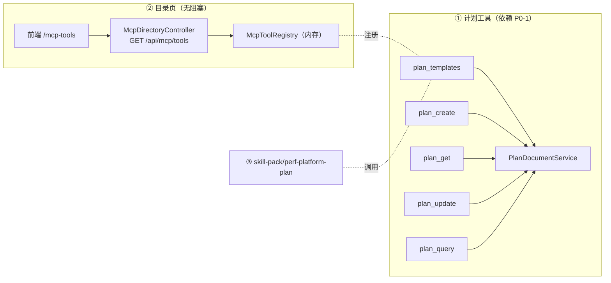

# P0-2 MCP Agent 接入面（计划工具集 + 工具目录页）—— 详细设计

> 生成于 2026-09-04 头脑风暴。P1-6（MCP 工具目录页）已于同日并入本任务（见 `docs/architecture-and-roadmap.md` §5）。
> 前置：**P0-1（计划文档模块重构）已落地并合并 main（2026-09-07 确认）**。②（目录页）已于 2026-09-04 交付；
> ①（计划 MCP 工具）服务层实现细节已按 P0-1 实际代码回填（**§6.1**，2026-09-07 修订），实施计划见
> `docs/superpowers/plans/2026-09-07-p0-2-plan-tools.md`。

## 1. 目标与验收口径

统一主题：**Agent 接入面**——工具（能力）+ 目录页（发现）+ skill（用法），一次交付"本地 Agent 可接入、可发现、会用"的完整体验。

| 交付物 | 验收口径（来自 roadmap P0-2 行） |
|--------|----------------------------------|
| ② MCP 工具目录页 | 新成员打开页面复制配置即可在本地 Agent 接入，无需问人；卡片信息与注册表一致 |
| ① 计划 MCP 工具 + ③ skill | 本地 Agent 仅凭 MCP + skill 完成"梳理→生成→同步→再修改"全流程 |

附加要求（2026-09-04 确认）：

- 新增 MCP 工具**零页面配置**：代码合入、服务重启即自动注册出现在目录页（方案 A 天然满足）。
- 页面支持查看 MCP 工具**状态**；每个工具提供**接口文档级**的功能清单说明（参数表、示例）。

## 2. 现状盘点与约束（代码事实）

- MCP Server 已运行：`/mcp` 端点（Streamable HTTP），仅接受机器身份 `X-API-Key`；`readonly` scope 主体不可见写工具（`McpToolRegistry.visible`）。
- `McpTool` 契约（`backend/.../platform/mcp/McpTool.java`）已含：`name / title / description / stage / requiresWriteScope / inputSchema / call`——**目录页所需字段基本齐备**，缺 D18 要求的"使用示例"元数据（本设计 §4.2 补）。
- 已注册 8 个工具（stage 分组）：NAVIGATE `list_projects`；DESIGN `start_execution`；OBSERVE `inspect_execution`；DIAGNOSE `analyze_execution`、`collect_evidence`；VERIFY `register_change`、`verify_change`；CAPTURE `request_evidence_capture`。
- 工具实现强制复用 Facade/domain service，错误走 `McpToolSupport.failure`（T4 稳定错误码体系）。
- API Key 管理页已存在：`AgentApiKeysPanel.vue` 挂在 Settings（`/settings`）；签发是管理员动作。
- 接入配置片段已有验证范本：`skill-pack/README.md`（Claude Code `~/.claude.json` 的 `mcpServers` 配置，`type: http` + `X-API-Key` 头）。
- skill 仓库约定：`skill-pack/perf-platform-*` 共 6 个，均为纯 `SKILL.md`（规定操作顺序/证据规范/停止条件，权限与风险由平台强制）。
- **P0-1 设计已替本任务定死接缝**（`2026-09-02-plan-document-module-design.md`）：
  - P0-2 MCP 工具**直接调用 `PlanDocumentService` / `PlanWorkflowService`**；
  - `plan_update` 复用 409 冲突语义与 `baseRevision`；
  - MCP 白名单（D12）在 P0-2 落地：publish 终态、删除类、分享创建不进 MCP；
  - "差异文本"由 MCP 与 REST 各自持有两版全文实现（D5）。

## 3. 总体结构与依赖

| 部分 | 内容 | 阻塞依赖 | 实施时机 |
|------|------|----------|----------|
| ② 目录页 | `GET /api/mcp/tools` + 前端 `/mcp-tools` 页 | 无 | **已交付（2026-09-04，见实施日志）** |
| ① 计划工具 ×5 | `plan_templates / plan_create / plan_get / plan_update / plan_query` | P0-1 的 PlanDocumentService / PlanWorkflowService / TaskPlanService | **P0-1 已合并，契约与服务层细节定稿（§6/§6.1）** |
| ③ perf-plan skill | `skill-pack/perf-platform-plan/SKILL.md` | ① 工具可用 | 流程定稿（§7）；随 ① 同批交付 |



## 4. 目录页后端设计

### 4.1 REST 端点

`api/McpDirectoryController`（`com.yr.perftest.platform.api` 包，与现有控制器同层）：

```
GET /api/mcp/tools        登录用户可读（Web 会话身份），只读
```

响应：

```json
{
  "server": { "name": "performance-test-platform", "endpoint": "/mcp", "toolCount": 8 },
  "stages": ["PLAN", "NAVIGATE", "DESIGN", "OBSERVE", "DIAGNOSE", "VERIFY", "CAPTURE"],
  "tools": [
    {
      "name": "list_projects",
      "title": "列出项目",
      "stage": "NAVIGATE",
      "requiresWriteScope": false,
      "status": "ENABLED",
      "description": "...",
      "usageExample": "...",
      "inputSchema": { "...": "原样透传工具的 JSON Schema" }
    }
  ]
}
```

- 数据**直接映射内存 `McpToolRegistry.all()`**，单一事实源：工具上下线随服务重启自动生效，**无任何页面侧配置**。
- `stages` = 服务端**固定规范序列常量**（`PLAN → NAVIGATE → DESIGN → OBSERVE → DIAGNOSE → VERIFY → CAPTURE`，闭环时序），不随注册表去重——筛选 tab 集合稳定，空阶段 tab 可选隐藏（前端决定）；`tools` 按该序列排序。
- 可见性口径：Web 页面展示**全部**注册工具并标注写权限徽标（页面面向"想了解平台能力的人"）；scope 过滤是 MCP 机器身份的调用期语义（`readonly` 调写工具被拒），不在目录页重复实现。

### 4.2 `McpTool` 元数据扩展

```java
/** 使用示例（D18：说明文案与使用示例作为工具元数据随平台发布维护）。 */
default String usageExample() { return ""; }
```

- `default` 方法：现有 8 个工具零改动（全量回归即可），**新工具（含 ① 的五个）必须提供**。
- 参数级说明写在 `inputSchema` 的 JSON Schema `description` 字段（前端据此渲染参数表，见 §5.3）。

### 4.3 状态字段口径（D18）

- 状态**只有两态**：`ENABLED`（可用）/ `DISABLED`（不可用），前端**纯图标呈现**（绿圈带勾 = 可用；灰圈带斜杠 = 不可用），不用文字标识。
- D18"启停与可见性由注册表 stage/scope 决定"的解释：**页面不做运行时启停/注册**；注册表 v1 无启停标志（全部 `ENABLED`），未来引入 `enabled` 后本端点透传、页面自动跟随，无需改版（单一事实源的好处）。（2026-09-04 用户确认：不引入"规划中"等第三态，路线图状态不进运行时 UI）

### 4.4 stage 新增 `PLAN`

- 现有 stage 常量集合（NAVIGATE/DESIGN/OBSERVE/DIAGNOSE/VERIFY/CAPTURE）新增 `PLAN`，① 的五个计划工具全部挂 `PLAN`——与 D2 二级状态机的"计划阶段"对齐，目录页筛选分组语义清晰。
- `McpServerConfiguration.toolSpecification` 现有的 `description + " [stage: ...]"` 拼接逻辑不变，`PLAN` 自动生效。

## 5. 目录页前端设计

### 5.1 路由与入口

- 顶级路由 `/mcp-tools`（`frontend/src/router/index.ts` 新增），`MainLayout` 导航新增「MCP 工具」入口。
- **不放 Settings 下**：Settings 是管理员语境（Agent API Key 签发），目录页面向全体项目成员。
- **布局流式铺满**：内容区不限宽居中，占满可用宽度；卡片网格随窗口自动增减列数，宽屏下不留两侧成片空白。（2026-09-04 效果图评审确认）

### 5.2 页头接入指引（横幅）

| 元素 | 内容 |
|------|------|
| endpoint | `http(s)://<平台地址>/mcp`（取当前 `location.origin` 拼接） |
| 认证说明 | 请求头 `X-API-Key: <Agent API Key>`；只读演练用 `readonly` scope，全流程用普通 scope |
| Claude Code 片段 | 一键复制 `~/.claude.json` 的 `mcpServers` JSON（内容采用 `skill-pack/README.md` 已验证范本） |
| DSH 片段 | 一键复制 DSH 接入配置 |
| 申请入口 | 链接 → `/settings`（已有 `AgentApiKeysPanel`） |

### 5.3 工具卡片与详情

- **列表形态**：**单一连续平铺网格，不做阶段分组渲染**——阶段的组织方式只由上方筛选标签承载。理由：分组网格在稀疏组（单工具阶段）下 `auto-fill` 空轨道不折叠且被 1fr 拉伸占位，右侧出现成片空白；末行的自然剩余为卡片列表正常形态。（2026-09-04 效果图评审反馈）
- **卡片网格**：名称（等宽字体）、`title`、stage 徽标、「需写权限」标记（`requiresWriteScope=true` 时）、**状态图标（可用/不可用两态，纯图标）**、`description`。
- **页脚**：列表下方收尾条——左侧「工具清单由服务注册表实时生成，随版本发布自动上下线」、右侧平台标识；为内容结束后的底部留白提供视觉终点。
- **点开卡片（抽屉/展开）= 接口文档式详情**：
  - 参数表格：从 `inputSchema.properties` 渲染——参数名 / 类型 / 是否必填（`required` 数组）/ 说明（`description` 字段）；
  - `usageExample` 代码块（等宽 + 复制按钮）；
  - stage、写权限、状态重复展示（详情自包含）。
- **筛选**：stage tabs（全部 + §4.1 固定序列）；**搜索**：名称/描述模糊匹配，前端本地过滤（数据量 ≤ 数十个，无需服务端搜索）。
- 页面纯**只读**：无启停、无编辑、无运行时注册（D18）。

### 5.4 前端工程落点

- `frontend/src/api/mcp-directory.ts`（新建，调用 `GET /api/mcp/tools`）；
- `frontend/src/components/mcp/McpToolDirectoryPage.vue`（新建）+ 详情抽屉子组件；
- `types/index.ts` 补 `McpToolSummary` / `McpDirectory` 类型；
- **视觉基准**：仓库根 `mcp-directory-prototype.html`（2026-09-04 可交互效果图，布局/两态状态图标/平铺列表/页脚/抽屉均按评审定稿，实施时对照还原）。

## 6. ①：计划 MCP 工具契约（2026-09-07 按 P0-1 实际实现对齐修订）

实现包：`backend/.../platform/mcp/plan/`（五个工具类 + `PlanToolsSupport` 共享支撑，模式对齐现有 `ListProjectsTool` 等）。

| 工具 | 写 | 入参 | 返回 / 语义 |
|------|----|------|-------------|
| `plan_templates` | 否 | `projectId?`（缺省 `1` 行为同 REST：内置 + 该项目模板） | `{ templates: [{ id, name, scope: "BUILTIN"\|"PROJECT", description, sections[], placeholders[] }] }`——`sections` 由 `PlanMarkdownSupport.splitSections(content)` 派生（模板含的规范章节标题）、`placeholders` 由 `{{...}}` 正则提取（当前仅 `{{planName}}`，机制可扩展）、`scope` 由 `projectId==null` 派生 |
| `plan_create` | 是 | `projectId, title, markdown, templateId?, remark?` | 创建草稿计划 → `{ planId, revision: 1, phase: "DRAFT", status: "DRAFT", title }`；`markdown` 非空时作为初始正文（revision=1 不加版，同模板渲染语义）；`markdown` 缺省时须给 `templateId`（工具校验模板可见性，未知/跨项目模板 → `PLAN_INVALID`），由模板渲染正文 |
| `plan_get` | 否 | `planId` | `{ planId, projectId, title, markdown, revision, phase, status, scenarioCount, updatedAt, createdBy }`——正文即唯一数据源（一稿走到头），不另设"结构化模块摘要"提取层 |
| `plan_update` | 是 | `planId, markdown, baseRevision` | 成功 → `{ planId, revision: n+1, updatedAt }`；revision 不匹配 → 错误码 **`PLAN_REVISION_CONFLICT`**，`error.details` 含 `currentRevision` + `serverMarkdown`（服务端全文；调用方本地已有自己那版，差异自算，D5）；非 DRAFT 阶段 → `PLAN_STATE`（details 含 `phase/status/allowedActions`） |
| `plan_query` | 否 | `projectId, phase?, keyword?, page?, pageSize?` | `{ plans: [{ planId, title, phase, status, revision, updatedAt }], total, page, pageSize }`——`phase` 过滤取 `PlanPhase.name()`（大小写不敏感）、`keyword` 对 title 不区分大小写包含匹配、分页在 `listPlans` 结果（id 倒序）上内存切片（计划量级小，无后端分页需求） |

- 五个工具 `stage()` 返回 `PLAN`；`plan_create` / `plan_update` `requiresWriteScope()=true`（readonly scope 主体不可见，复用 `McpToolRegistry.visible`）。
- **白名单（D12，不进 MCP）**：publish 终态、删除类、分享创建、评审 approve、批注增删、状态流转（submit/withdraw/backToDraft/startExecution/toReport/generateReport/newRevision/precheck）——本地 Agent 引导用户回平台操作。MCP 面 = 模板读 + 文档 CRUD + 列表查询，共 5 工具。
- 冲突处理姿势（供 ③ skill 与实现共用）：调用方拿 `plan_get` 的 `revision` 作 `baseRevision` 更新；遇 `PLAN_REVISION_CONFLICT` 自行 diff 两版全文，按 D5 三选一（保留平台版/采纳本地版/手改合并后以新 revision 重提）。
- **与 2026-09-04 原契据的差异**（P0-1 落地后对齐）：`plan_create` 增加 `remark?`、返回 phase/status 枚举名而非中文；`plan_get` 以 markdown 全文替代"structuredModules 摘要 + scenarioSummaries"（P0-1 修订 5 已取消结构化 JSON 列，全文即内容）；`plan_update` 错误码从 `REVISION_CONFLICT` 定名 `PLAN_REVISION_CONFLICT`（与 REST `PlanErrorBody` 同词表）。

### 6.1 服务层调用细节（按 P0-1 实际代码定稿）

**调用接缝**（工具 → 服务，全部既有公共 API，仅一处新增重载）：

| 工具 | 调用 | 说明 |
|------|------|------|
| `plan_templates` | `PlanWorkflowService.listTemplates(projectId)` | 只读；内置 + 项目模板（`findAllVisible`，builtin 优先） |
| `plan_create` | **新增** `TaskPlanService.createPlan(projectId, name, remark, controller=null, workers=null, monitors=null, createdBy, templateId, initialMarkdown)` | 9 参重载：现有 8 参版委托它（`initialMarkdown=null`）；`initialMarkdown` 非空直接作为初始 `body`（同模板渲染走 `initializeBody` 语义，**revision=1 不加版**）；单事务 |
| `plan_get` | `PlanDocumentService.getDocument(planId)` | 内含执行态惰性纠偏；不存在 → `PlanValidationException`（PLAN_INVALID） |
| `plan_update` | `PlanDocumentService.updateMarkdown(planId, baseRevision, markdown, actor)` | 悲观行锁内比对 revision；冲突 → `PlanRevisionConflictException(currentRevision, serverMarkdown)`；非 DRAFT → `PlanStateException(phase, status, allowedActions)`；成功返回完整 `TaskPlan`（工具裁剪为 `{ planId, revision, updatedAt }`） |
| `plan_query` | `TaskPlanService.listPlans(projectId)` | 全量 id 倒序；过滤/分页在工具层内存完成 |

**机器身份映射（关键决策）**：plandoc 服务签名要求 `HumanPrincipal`，而 MCP 主体是 `MachinePrincipal(apiKeyId, scope)`（无 username）。映射策略：`PlanToolsSupport.agentActor()` 合成 `new HumanPrincipal("agent", Set.of(SystemRole.ADMIN))`。理由：与既有 agent 面哲学一致——机器 Key 由管理员签发即受信操作者，授权边界 = API Key scope（readonly 不可见写工具）+ 治理层（审计/限流），不做按项目成员判定（`list_projects`/`start_execution` 同样不查项目成员）；D12 白名单限定 MCP 可触达的动作集。代价：非只读 Key 可经 MCP 编辑任意项目计划文档——与 `start_execution` 既有爆炸半径相同，审计可溯（apiKeyId 落审计）。`plan_create` 的 `createdBy` 记 `"agent"`，人工接手靠项目 OWNER/系统 ADMIN 权限（编辑/流转/删除矩阵均覆盖）。

**错误码与负载映射**（`McpToolSupport` 扩展 + `PlanToolsSupport` 捕获）：

- `McpToolSupport` 新增 `error(objectMapper, code, message, details)` 重载——`error` 对象可携带 `details` 字段（Map 透传）；`codeOf` 补四个分支：`PlanRevisionConflictException → "PLAN_REVISION_CONFLICT"`、`PlanStateException → "PLAN_STATE"`、`PlanAccessDeniedException → "PLAN_ACCESS_DENIED"`、`PlanValidationException → "PLAN_INVALID"`（与 REST `PlanErrorBody` 同词表；`AgentErrorCode` 枚举不动——它是 `/api/agent/**` REST 封套词表，MCP 错误码本就是字符串）。
- `PlanToolsSupport.callSafely(mapper, supplier)`：先捕 `PlanRevisionConflictException`（details: `currentRevision`/`serverMarkdown`）与 `PlanStateException`（details: `phase`/`status`/`allowedActions`），再落 `McpToolSupport.failure`。冲突负载经此透传，满足"负载含 currentRevision + 全文"。

**目录页联动**：五工具以 `stage()="PLAN"` 注册进 `McpToolRegistry`，目录端点与 `/mcp-tools` 页零改动自动呈现（13 工具/PLAN 计数 5）——方案 A 单一事实源的直接收益。

## 7. ③：skill-pack/perf-platform-plan

- 位置：`skill-pack/perf-platform-plan/SKILL.md`——**跟随仓库既有命名约定**（现有 6 个 skill 均 `perf-platform-<环节>`；2026-09-07 修订：原写 `perf-plan`，定名 `perf-platform-plan`，roadmap D3 措辞同步，见 §9 决策 5/10）。
- 与现有 6 个 skill 同模式：纯 SKILL.md（frontmatter `name`/`description` + 目的 / 操作顺序 / 证据规范 / 停止条件），只规定操作顺序与停止条件，权限/脱敏/审计由平台强制（skill 不依赖）。

SKILL.md 流程骨架：

1. **对话梳理**：测试目的 → 核心指标（挂交易）→ 测试范围与配比 → 测试资源（人员/环境部署/执行节点）→ 测试约束（入口/出口准则）→ 排期。
2. **拉模板**：`plan_templates` → 按占位符清单逐项向用户确认。
3. **本地生成**：填充模板渲染 Markdown 全文（11 章节规范结构），向用户展示确认。
4. **同步平台**：`plan_create`（markdown=渲染全文）→ 返回计划 ID 与平台链接，引导用户进平台走评审。
5. **评审反馈再修改**：`plan_get` → 本地修改 → `plan_update`（带 `baseRevision`；遇 `PLAN_REVISION_CONFLICT` 用 details 内 `serverMarkdown` 与本地版 diff，按 D5 三选一处理后重提；遇 `PLAN_STATE` 说明已非草稿——停止改稿引导回平台）。
6. **停止条件**：计划进入评审阶段后 skill 停止改稿（批注与流转由平台承载）；skill 不做发布、删除、分享、评审流转。

## 8. 待完成事项（2026-09-07 起消化：P0-1 已合并，设计已回填，实施按计划文档执行）

- [x] ~~五个工具实现类（`mcp/plan/` 包）+ 服务层调用细节~~ → 设计定稿 §6.1（接缝表 + `TaskPlanService` 9 参重载）
- [x] ~~`plan_update` REVISION_CONFLICT 错误码与负载格式~~ → 定名 `PLAN_REVISION_CONFLICT`，`error.details` 携带 `currentRevision`/`serverMarkdown`；`PLAN_STATE`/`PLAN_INVALID`/`PLAN_ACCESS_DENIED` 同批映射（§6.1）
- [x] ~~`plan_templates` 与 P0-1 模板体系字段对齐复核~~ → 实体无 sections/placeholders 列，由 `splitSections` + `{{...}}` 正则派生，加 `description`（§6）
- [x] ~~服务层细节待完成事项补充~~ → §6.1（含机器身份映射决策：合成 `HumanPrincipal("agent", ADMIN)`）
- [ ] 五条 `usageExample` 编写（含一条冲突处理示例）——随实现
- [ ] `stage=PLAN` 注册与目录页筛选联测（目录端点/页面零改动，验证自动呈现）——随实现
- [ ] `skill-pack/perf-platform-plan/SKILL.md` 编写 + `skill-pack/README.md` 组件表补行 + `verify/acceptance-smoke.sh` 扩展计划工具只读调用
- [x] D3 措辞同步（`skills/perf-plan/` → `skill-pack/perf-platform-plan/`）——用户指令继续 P0-2 未完项即确认执行（2026-09-07）

## 9. 决策与待确认

| # | 决策 | 状态 |
|---|------|------|
| 1 | 目录页数据通路 = 注册表 REST 端点（方案 A），单一事实源，新工具零页面配置 | 已确认（2026-09-04） |
| 2 | `McpTool` 加 `default usageExample()`，新工具必填 | 本设计推荐，随文档评审确认 |
| 3 | stage 新增 `PLAN`，计划工具挂 PLAN | 本设计推荐，随文档评审确认 |
| 4 | 目录页顶级路由 `/mcp-tools`，不放 Settings | 本设计推荐，随文档评审确认 |
| 5 | skill 放 `skill-pack/` 下并同步 D3 措辞；命名定为 `perf-platform-plan`（对齐既有 `perf-platform-*` 六技能） | 已确认（2026-09-07 修订定名） |
| 6 | 状态两态 `ENABLED`/`DISABLED`，纯图标呈现；不设"规划中"第三态；启停为注册表未来能力，端点透传、页面自动跟随 | 已确认（2026-09-04 用户反馈修订） |
| 7 | ① 服务层细节 + ③ skill 编写延后至 P0-1 落地（§8 清单跟踪） | 已确认（2026-09-04）；P0-1 已合并，§6.1 回填 |
| 8 | 目录页列表 = 单一平铺网格，不做阶段分组渲染（阶段仅由筛选 tabs 承载）；内容区流式铺满；页脚收尾；视觉基准 = 仓库根 `mcp-directory-prototype.html` | 已确认（2026-09-04 效果图评审反馈） |
| 9 | 机器身份映射：`PlanToolsSupport.agentActor()` 合成 `HumanPrincipal("agent", ADMIN)`——与 agent 面"管理员签发 Key 即受信操作者"哲学一致，授权边界 = scope + 治理层 + D12 白名单，不做按项目成员判定 | 已确认（2026-09-07，§6.1 详述理由与代价） |
| 10 | `TaskPlanService` 新增 9 参 `createPlan` 重载（`initialMarkdown` 直接作初始正文，revision=1 不加版）；`plan_get` 不做结构化摘要提取层（全文即内容）；`plan_query` 过滤分页在工具层内存完成 | 已确认（2026-09-07 按 P0-1 实际代码定稿） |
| 11 | MCP 错误码与 REST `PlanErrorBody` 同词表（`PLAN_REVISION_CONFLICT`/`PLAN_STATE`/`PLAN_INVALID`/`PLAN_ACCESS_DENIED`），`AgentErrorCode` 枚举不动；`McpToolSupport.error` 增加 `details` 负载通道 | 已确认（2026-09-07） |

## 10. 测试与验收

- **后端（②，先行）**：
  - `McpDirectoryControllerTest`：返回与 `registry.all()` 严格一致（数量/字段/stage 集合含 PLAN 排序）；未登录 401；`usageExample` 默认空串不影响现有 8 工具（全量回归）。
- **前端（②）**：手测清单——阶段筛选、搜索、两个配置片段复制、API Key 申请入口链接可达；宽屏铺满无成片空白、平铺无分组头、状态图标两态、页脚渲染；字段与端点响应对齐（对照 `mcp-directory-prototype.html` 视觉基准）。
- **①（实施中，2026-09-07）**：五工具集成测试（`mcp/plan/` 下，覆盖：模板派生字段、create 初始正文 revision=1、get 全文、update 成功/`PLAN_REVISION_CONFLICT` details 负载/`PLAN_STATE`、query 过滤分页、未知模板 `PLAN_INVALID`、markdown 与 templateId 均缺省校验）；`McpServerApiTest` 工具清单断言扩至 13 个 + readonly scope 不可见 `plan_create`/`plan_update`；`McpDirectoryControllerTest` 补 PLAN 工具排序断言。
- **③（实施中）**：skill 按验收口径人工走查"梳理→生成→同步→再修改"全流程；`skill-pack/verify/acceptance-smoke.sh` 扩展 `plan_templates`/`plan_query` 只读调用 + 工具清单 13 项断言。
- 总验收 = roadmap P0-2 行两条口径。
