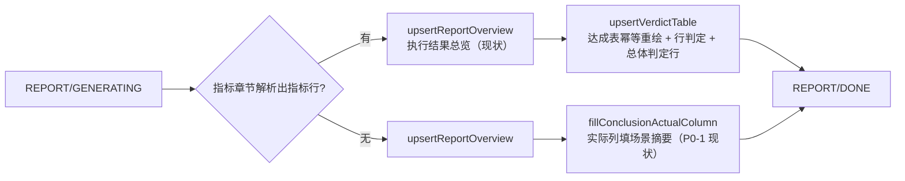

# P0-3 验收标准解析 + 自动判等（指标可选）—— 详细设计

> 来源：`docs/architecture-and-roadmap.md` P0-3 行 + 2026-09-07 brainstorm（两轮复议：①指标可选双路径；②预设模板决定后不建判等实体），逐节与负责人确认；遵循 D1/D2/D3（2026-09-07 修订）/D4/D6（2026-09-07 修订）/D12。
> 状态：设计已确认，待实施。

## 1. 背景与决策动因

原 P0-3 口径隐含"每个计划都有、且应该有量化验收指标"。2026-09-07 讨论确认两类真实场景不成立：

1. **摸底测试**：首次测试且未上线，目标是拍脑袋定的、与实际可能差异巨大——实测值本身才是交付物；对拍脑袋的阈值判"不通过"是噪音甚至误导（实测 80 不是失败，是这次测试要找的答案）。
2. **排查型测试**：目标是复现/解决特定问题（如 OOM），对 TPS/RT 无要求——验收本质是定性判断，P0-3 阶段平台无数据可自动判（OOM 在被测侧、内存趋势依赖 P1-8 监控深化）。

**结论：指标可选、双路径。**

- 有指标 → 自动判等 + 达成表重绘 + 结论预填，发布前人工确认（D4 半自动不变）。
- 无指标（摸底/排查型）→ 判等跳过、达成表退化为实测记录（P0-1 现状）、总体结论纯人工填写。
- **无指标是并列的一等路径，不是异常路径**；文档不含指标章节即自然落入该路径。

摸底与判等的关系定位：摸底的自然动线是两轮——第一轮无目标（或标注参考目标）跑出实测 → 拿实测修订指标 → 复测判等。平台"一稿走到头 + 复测重置报告为待生成"已支持该循环。

**第二轮复议（同日）**：初版设计曾引入 `plan_acceptance_criteria` 持久化实体（"文档结构不可靠"顾虑下的解耦产物）。随"模板只保留内置预设"决定（D3 2026-09-07 修订），映射确定性由结构契约保证，实体失去不可替代的消费者——**移除实体，判等输入 = 文档指标章节本身**；保存校验、报告判等共用同一解析器。

## 2. 决策摘要

| # | 决策 | 依据 |
|---|------|------|
| V1 | 验收指标**可选**；无指标计划判等跳过、结论纯人工 | §1 两类场景 |
| V2 | 指标书写面与判等输入 = 文档"二、测试目的与指标"章节表格（**不建持久化实体**）；保存链上"解析即校验"（格式非法 400），报告生成与 verdict 复用同一解析器确定性解析 | 预设模板契约（D3 2026-09-07）使解析确定性；判等每报告周期仅解析一次 |
| V3 | 判等输入冻结来自 P0-1 编辑阶段规则（文档仅 DRAFT 可改、执行开始至发布前不可改），非实体性质 | 审计可追溯（发布快照存 body 全文） |
| V4 | 绑定两层：对象=场景名 → 该场景最近执行 `Summary`（TPS/平均RT/P95/错误率）；对象=交易名 → `AggregateRow`（含 P99）；并发峰值/容量/未识别类型 → 无法判定（需人工） | `TaskExecutionResult` 数据面 |
| V5 | 行状态三态：**达成 / 未达成 / 无法判定**（附原因）；计划级聚合：任一未达成→未达成，全部达成→达成，其余→无法判定；无指标→不产生判定。刻意不用"通过/不通过"措辞 | 摸底语义（"未达成"是相对所声明目标的事实） |
| V6 | 达成表由判等引擎在报告生成时基于解析结果**幂等重绘**（`<!-- backfill:verdict -->` 块，与执行结果总览块同模式）；无指标计划不重绘 | 文档为唯一事实源，杜绝指标章节与达成表两处手抄漂移 |
| V7 | 总体结论**不预写文档**；后端返回自动判定文本，前端发布弹窗预填输入框；`publish` 必填语义不变 | D4 |
| V8 | verdict 只读接口**即时重算、不持久化**；仅 REPORT/DONE 与 PUBLISH/PUBLISHED 阶段可读，复测重置后返回未生成 | 判等输入确定性、免失效管理；审计以文档达成表与发布快照为准 |

## 3. 指标解析契约与校验（不建实体）

**不建 `plan_acceptance_criteria` 表**：该实体是"文档结构不可靠"顾虑的中间产物；预设模板决定后映射确定性由结构契约保证，持久化失去独立价值。判等输入 = 文档指标章节；实现为 `task/plandoc` 内纯静态解析器（新增 `PlanAcceptanceParser`，或并入 `PlanMarkdownSupport`），保存校验与报告判等共用。

### 3.1 保存时严格校验（解析即校验，不落库）

挂点：`PlanDocumentService` 全文保存链（Web `PUT /api/task-plans/{id}/document`、Pretty 章节编辑前端合并后整体提交、MCP `plan_update` 三者共用）。保存时按规范标题定位"二、测试目的与指标"章节（复用 `PlanMarkdownSupport.extractSection`，含序号容错）并解析表格，仅做校验、不持久化：

| 提交原文指标章节状态 | 保存结果 |
|---|---|
| 表格合法、N 行 | 200（报告期按同一解析器确定性解析判等） |
| 章节缺失 / 章节内无表格 / 空表 | 200 → 无指标路径 |
| 有表格但表头列不符 | 400 `PLAN_INVALID`，指明缺哪些列 |
| 数据行单元格数不足 / 已知类型目标值非数字 | 400 `PLAN_INVALID`，指明行号与原因 |
| 指标类型未识别 | 200，判等时落 OTHER（无法判定） |

严格拒绝（第 3、4 行）保留：格式错误在作者编辑当下暴露，而非报告期才静默丢指标。

### 3.2 冻结与审计（来自 P0-1 阶段规则）

- 文档编辑仅允许 DRAFT；执行开始至发布前文档不可改（P0-1 既定）→ **判等输入天然冻结**，判等结果可追溯到一个明确的文档 revision。
- 发布快照存 body 全文（含指标表与达成表块），即审计基线。
- 报告期兜底：存量文档万一解析失败（早于严格校验的旧数据），判等降级为无法判定并标注原因，不阻断报告生成。

### 3.3 位置/模板适应性与 MCP

- 章节定位按标题（含序号容错）不按位置，章节挪动不影响；标题失配/章节删除 → 解析不出指标 → 无指标路径，失败模式是"少了自动化"，永远不是"判错"。
- 模板只保留内置预设（D3 2026-09-07 修订）并随平台版本演进：模板调整与解析契约同版本生效，解析器对存量文档向后兼容，不兼容变更须附迁移。
- MCP 天然成立：`plan_update` 本就走保存链，严格校验同样生效；无同步概念（D12 无冲突：不新增 MCP 工具）。

### 3.4 指标类型与别名

别名映射（trim + 大小写不敏感）：

| 原文写法 | 类型 | 方向 | 单位 | v1 可自动判 |
|---|---|---|---|---|
| TPS / 吞吐量 / throughput | TPS | 实际 ≥ 目标 | req/s | ✅ 场景级+交易级 |
| 平均RT / 响应时间 | AVG_RT | 实际 ≤ 目标 | ms | ✅ 场景级+交易级 |
| P95 / P95响应时间 | P95 | 实际 ≤ 目标 | ms | ✅ 场景级+交易级 |
| P99 | P99 | 实际 ≤ 目标 | ms | ✅ 仅交易级（场景 Summary 无 P99） |
| 错误率 | ERROR_RATE | 实际 ≤ 目标 | %（0.1 即 0.1%） | ✅ 场景级+交易级 |
| 并发峰值 | PEAK_CONCURRENCY | — | — | ❌ 无数据源（待 P1-8） |
| 容量 | CAPACITY | — | — | ❌ 无数据源 |
| 其它任何文本 | OTHER | — | 自由文本 | ❌ 保留原文，人工评估 |

未识别类型放行而非拒绝：文档是给人写的，允许"GC 次数"这类行存在，判不了就明说，不假装能判。

### 3.5 模板微调（无生产数据，直接改 seed）

- 内置模板指标表头 `[交易|指标|目标值|口径]` → `[对象|指标|目标值|口径]`，"对象"语义 = 场景名或交易名（呼应 D1"指标挂交易"，扩展至场景）。
- 结论章节达成表占位更新为重绘后形态（§5）。
- Pretty 指标表单列名同步改"对象"。

## 4. 判等引擎

### 4.1 取数口径（与报告零分歧）

复用 P0-1 报告生成同源口径：**每场景最近一次执行**（`latestScenarioSummaries` 同一数据路径）。报告"实际"列与判等"状态"列出自同一批数据，互相印证。指标行（对象/类型/目标值）来自 §3 解析器对文档指标章节的确定性解析（与保存校验共用）。实际值：场景级取 `TaskExecutionResult.Summary`（throughput/avgRt/p95/errorRate），交易级取 `AggregateRow`（label/average/p95/p99/errorRate/throughput）。

### 4.2 对象绑定与行级判定

对象解析顺序：

1. **精确匹配场景名** → 该场景最近执行 Summary，判 TPS/AVG_RT/P95/ERROR_RATE；场景无执行 → 无法判定（无执行）。
2. 未中场景名 → **精确匹配交易名（label）**：在各场景最近执行的 AggregateRow 中查找；恰好一处命中 → 按行判（含 P99）；多场景命中同名 → 无法判定（同名交易出现在多个场景，请改用场景名对象或拆分场景）；零命中 → 无法判定（未匹配对象）。
3. 指标类型为 PEAK_CONCURRENCY/CAPACITY/OTHER，或绑定成功但类型在该绑定层不可判（如场景级 P99）→ 无法判定（附原因）。

行级输出：`达成 / 未达成 / 无法判定` + 原因短语 + 所依据的 scenarioId/executionId（供下钻）。

### 4.3 计划级总体判定

- 全部可判行达成 → **达成**
- 任一行未达成 → **未达成**（列出超标行）
- 其余（有无法判定、无未达成）→ **无法判定（部分需人工评估）**
- 无指标（解析不出指标行）→ **不产生总体判定**（无指标路径）

## 5. 报告生成与达成表重绘

`generateReport` 改造（顺序）：



**达成表重绘**（`<!-- backfill:verdict -->` 幂等块，替换语义与执行结果总览块一致：标记行整块替换到块尾，块尾 = 其后第一个其它标题行或 `**总体结论**` 行之前）：

```markdown
<!-- backfill:verdict -->
#### 指标达成表（生成于 2026-09-07 14:30）

| 对象 | 指标 | 目标 | 实际 | 状态 | 说明 |
|---|---|---|---|---|---|
| 登录场景 | P95 | ≤ 800ms | 912ms | 未达成 | 取自场景最近执行 |
| 下单交易 | TPS | ≥ 500 | 623.5 | 达成 | 取自最近执行 label 汇总 |
| 系统容量 | 容量 | 1万在线用户 | — | 无法判定 | 该指标当前不可自动判定，需人工评估 |

- 自动判定：未达成（1 项未达标、1 项需人工评估）——登录场景 P95
```

- 有指标时实际列填**判定所用数值**（带单位），不再填场景摘要文本（摘要仍由执行结果总览块承载）。
- 无指标计划：不写入该块、达成表保持原文形态、实际列照 P0-1 现状填场景摘要——**摸底/排查型的报告 = 执行结果总览 + 实测记录表 + 人工结论**，链路无判等阻塞。
- 重复生成报告：块替换不叠加；系统写入不校验 baseRevision、`revision+1`（P0-1 §8.2 回填规则）。

## 6. verdict 接口与前端

### 6.1 接口

```
GET /api/task-plans/{planId}/verdict     （项目成员，读门槛与报告一致）
→ 200 {
  present:     boolean,   // 是否解析出指标行
  available:   boolean,   // 阶段门槛：REPORT/DONE、PUBLISH/PUBLISHED 为 true
  overall:     "PASSED" | "FAILED" | "INDETERMINATE" | "NONE",
  prefillConclusion: string | null,   // 自动判定文本（发布弹窗预填用；present=false 为 null）
  rows: [ { object, metricRaw, metricType, targetRaw, targetValue,
            actualValue, status, reason, scenarioId, executionId } ]
}
```

- 即时重算不持久化：判等输入（冻结的文档指标章节〔P0-1 阶段规则〕+ 每场景最近执行）确定性，重算即幂等；审计以文档达成表与发布快照 body 为准。
- 阶段门槛：复测重置后 `available=false`（overall=NONE、reason=报告未生成），杜绝"接口算的是新执行、文档达成表还是旧的"。

### 6.2 前端

- **报告 Tab**：总体判定徽章（达成/未达成/无法判定）+ 未达标行清单；达成表行下钻——场景行跳该场景最近执行详情页（复用现有执行详情路由）；无指标计划显示正常态提示条"本计划无验收指标（摸底/排查型），总体结论由人工填写"。
- **发布弹窗**：总体结论输入框预填 `prefillConclusion`（人可改可重写）；`publish` 必填校验不变。
- **Pretty 指标表单**：列名"交易"→"对象"（§3.5）。
- `frontend/src/api/plan-doc.ts` 扩展 verdict 类型与调用。

## 7. 与其它任务边界

| 任务 | 关系 |
|---|---|
| P0-1 计划文档 | 复用章节定位/幂等块/回填 revision 规则与解析契约；模板 seed 表头微调；P0-1 设计 §16"或引入实体"活口由本设计合上（结论：不建实体） |
| P0-2 MCP | `plan_update` 全文保存同样触发严格校验，无新 MCP 工具、无白名单冲突（D12） |
| P1-4 迭代对比 | 消费发布快照（body 含达成表块与自动判定行）；是否另用 verdict 结构化数据由 P1-4 设计时定 |
| P1-8 监控深化 | 并发峰值/容量具备数据源后升级为可判（§3.4 能力矩阵扩展点） |
| P0-4 MySQL | 无新 DDL（不建判等实体） |
| 模块拆分并行轨道 | 不拆 Maven 模块，新类放 `task/plandoc` |

## 8. 文档修订（随本设计同步执行）

1. `docs/architecture-and-roadmap.md` D6：指标可选、不建判等实体、两层判定、无指标判等跳过（2026-09-07 修订）。
2. `docs/architecture-and-roadmap.md` P0-3 行：工作项与完成口径按本设计更新。
3. `docs/superpowers/specs/2026-09-02-plan-document-module-design.md`：§3.1 注、§8.3、§16 P0-3 边界行按本设计更新。
4. `docs/requirements-spec.md` 路线图摘录行同步措辞。

## 9. 测试计划

沿用两风格（JUnit 5 `@SpringBootTest` 集成 + MockMvc）：

- **保存校验**：合法表保存 200 且报告期解析结果与之逐行一致；空表/缺章节/无表格保存 200 落无指标路径；表头缺列、行单元格不足、已知类型非数字 → 400 且文档不变；未识别类型保存 200、判等落 OTHER；MCP `plan_update` 保存同样校验。
- **判等引擎**：场景绑定四指标方向判定（≥/≤）；交易绑定含 P99；多场景同名 label → 无法判定；场景无执行 → 无法判定；并发峰值/容量/OTHER → 无法判定带原因；聚合三分支 + 无指标分支；错误率百分比口径。
- **报告链路**：有指标 → 达成表重绘（数值实际列 + 状态 + 自动判定行）+ verdict 可读；无指标 → P0-1 现状不回归；重复生成幂等；系统回填 revision+1；复测重置后 verdict `available=false`。
- **发布链路**：总体结论必填不变；预填仅为前端行为（后端不预写文档）。
- **端到端两条**：有指标计划 草稿(含指标)→评审→执行→报告(判定未达标)→发布（人工确认结论）；无指标摸底计划同链路判等全程跳过、实测记录表 + 人工结论正常发布。

## 10. 明确不做（YAGNI）

- **判等指标持久化实体/投影缓存**——预设模板契约下解析确定性成立、判等每报告周期仅一次；将来内容级查询或"执行中目标线"需要时再加 doc-wins 只读投影。
- 摸底实测"一键转下轮参考目标"——与 P1-4 场景手动基线兜底（D11）同质，归 P1-4 联动。
- 排查型"定性验收清单"结构（人工逐项勾选）——自由文本（总体结论/风险建议）承载，真实使用不够再加。
- 并发峰值/容量自动判定——待 P1-8 数据源。
- verdict 持久化与历史判定查询——审计走文档与快照。
- 指标行级 diff UI——冲突三选一（D5）已覆盖文档全文维度。
