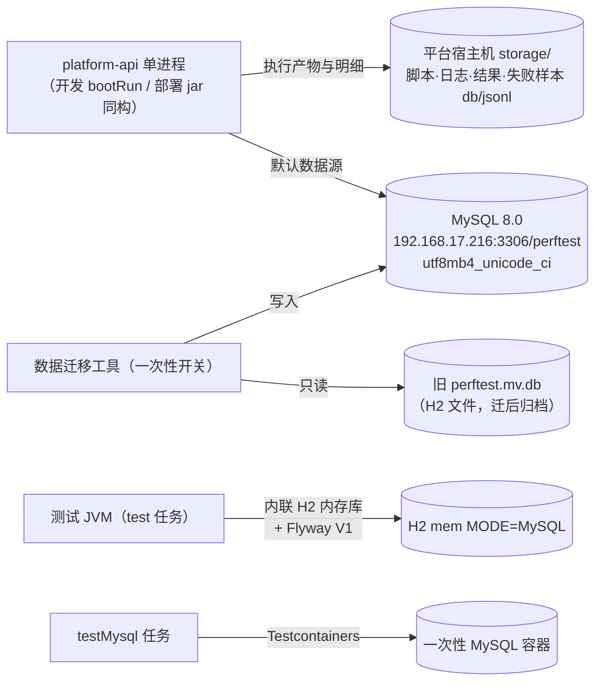

# P0-4 主库 MySQL 迁移与 schema 版本化设计

> 生成于 2026-09-07 头脑风暴（brainstorming 会话）。本文档是 P0-4 的设计权威，实施按 writing-plans 拆计划。
> 上游输入：`docs/architecture-and-roadmap.md`（D14 修订见 §1.2）、`docs/environment.md`（三台测试服务器）。

## 0. 结论摘要

P0-4 从「主库 + 执行明细统一迁 MySQL」**收窄为「主库迁 MySQL + schema 版本化」**：

- **MySQL 成为运行时唯一数据源**（服务器 Docker 部署，默认连服务器，不保留 H2 运行时 profile，不做离线兜底）；
- **执行明细（失败样本 SQLite/jsonl、jmeter 日志、结果文件）不迁库**，维持平台宿主机 `storage/` 按执行分文件；
- **引入 Flyway**：50 张表冻结为 V1 基线，`ddl-auto` 切 `validate`，终结手工脚本漂移；
- **存量 H2 数据一次性迁入 MySQL**（表驱动 JDBC 拷贝工具，旧文件只读归档）；
- **测试策略**：现有测试照旧跑 H2 内存库（零改动，白得 V1 双方言回归网）+ 新增 Testcontainers 真 MySQL 集成测试（tag 隔离，验收必跑）。

## 1. 背景与范围

### 1.1 现状（2026-09-07 摸底）

- 主库：单数据源 H2 文件库 `./storage/perftest`（`MODE=MySQL;DATABASE_TO_LOWER=TRUE;AUTO_SERVER=TRUE`），`ddl-auto: update`，50 个 JPA 实体 / 50 个 Repository，无 nativeQuery，主键全部 `IDENTITY`。
- 执行明细：`execution/failure/FailureSampleStore` 用 `DriverManager` 直连 SQLite，**每次执行一个 `failure-samples.db` 文件**（含 PRAGMA/AUTOINCREMENT/INSERT OR IGNORE 等 SQLite 专有语法），同目录 `failure-samples.jsonl` 为原始 tail 流。
- Schema 管理：无 Flyway/Liquibase；`docs/database/mysql-schema.sql` 手工维护且**已落后实体约 18 张表**，不能再用。
- `monitoring/MonitoringSchemaInitializer`：JdbcTemplate 裸 DDL 给存量库补列（H2/MySQL 双分支）——它存在的唯一原因就是没有迁移机制。
- 部署：无平台自身 Dockerfile/compose（`deploy/monitoring/` 只是 Prometheus 栈）；README 方案 B 预设了 MySQL 路线但引用的 `application-prod.yml` 并不存在。
- 测试：约 63 个 `@SpringBootTest` + 12 个 `@DataJpaTest`，全部内联 H2 内存库（`MODE=MySQL`），无 `src/test/resources` 配置文件。

### 1.2 D14 修订（2026-09-07）

原口径「主库 + 执行明细一次性统一迁 MySQL；H2 留本地开发 profile」修订为：

1. **主库迁 MySQL，运行时唯一数据源**；本地调试默认连服务器 MySQL，不保留 H2 运行时 profile（明确不考虑断网场景）。
2. **执行明细不迁库**：失败样本 SQLite/jsonl、jmeter 日志、结果文件维持平台宿主机按执行分文件。理由：明细体量大（失败率高时单次执行可达 GB 级、LONGTEXT 重），入库带来缓冲池污染/备份膨胀/删除退化；按执行分文件「删执行即删文件」是运维优势；路线图近中期无跨执行查样本的需求（P0-3 读聚合、P1-4 读快照、P2-3 删文件更顺、P3-7 引用样本用 executionId+sampleId 足够）。
3. **H2 仅作为测试内存库存在**于测试代码/依赖中；**存量 H2 数据由一次性迁移工具带入 MySQL**，旧 H2 文件迁后归档。

### 1.3 库与文件的分工边界（消除歧义）

| 存 MySQL（库表） | 留平台宿主机文件（`storage/`） |
|---|---|
| 全部 50 张实体表：项目/账号/脚本元数据/计划文档/批注/模板/发布快照/`scenario_executions` 执行记录行/聚合报告/秒级指标/造数配置/监控目标/审计等 | 脚本 JMX、执行工作目录（`jmeter.log`、结果文件、`failure-samples.jsonl`、`failure-samples.db`） |

即：执行**记录**（元数据行）在库，执行**产物与明细**（大文件）在盘。本次迁移不移动这条边界。

### 1.4 明确不做

- 执行明细迁 MySQL（§1.2 第 2 条，D14 修订）。
- 平台自身 Dockerfile / `scripts/start.sh`（P2-1 范围；P0-4 只做「Docker 起 MySQL」）。
- 存量数据搬迁**脚本之外**的历史数据修复、多环境数据同步。
- 种子账号逻辑搬进 Flyway：`config/PlatformServiceConfiguration` 的 create-if-absent 式 admin/tester 初始化**保留在 Java**（搬进脚本需固化密码哈希字符串，不值得冒险）。
- 测试全面 Testcontainers 化 / 测试直连共享服务器 MySQL（已评估并否决：日常开发强依赖 Docker/网络，多轮测试需自建隔离库易互踩）。

## 2. 本次设计定死的口径

| # | 决策 | 内容 |
|---|---|---|
| M1 | schema 机制 | 引入 **Flyway**（flyway-core + flyway-mysql），V1 全量基线，`ddl-auto` 全局切 `validate`；废弃并删除 `docs/database/mysql-schema.sql`；`MonitoringSchemaInitializer` 收编进 V1 后删除 |
| M2 | 执行明细 | 留文件不迁库（D14 修订 §1.2） |
| M3 | 运行时数据源 | **只有 MySQL**：`application.yml` 默认指向服务器 MySQL（规划 192.168.17.216，实施换机则同步 environment.md 与配置）；无 local-h2 profile、无 H2 console；不考虑断网兜底 |
| M4 | 存量数据 | **要迁**：一次性 H2→MySQL 表驱动拷贝工具，随 P0-4 交付（§5） |
| M5 | 测试 | 现有测试零改动跑 H2 内存库；新增 Testcontainers 真 MySQL 集成测试（`@Tag("mysql")`，默认 `test` 不含，验收必跑）；三台测试服务器作共享常驻 MySQL 与验收走查环境 |
| M6 | 双方言 | V1 单套脚本必须同时在 H2 `MODE=MySQL`（测试）与真 MySQL（运行时/集成测试）可执行且过 validate；退路为 Flyway vendor 目录分家（§4.3） |

## 3. 目标形态

配置形态（`backend/src/main/resources/`）：

| 文件 | 内容 |
|---|---|
| `application.yml` | 公共配置 + **默认 MySQL 数据源**（服务器地址、应用账号、utf8mb4 连接参数）、Flyway enabled、`ddl-auto: validate`、Hikari 适度参数；删除 H2 console 与 H2 URL |
| `db/migration/V1__baseline.sql` | 全量 50 表基线（§4） |

- 连接串关键参数：`characterEncoding=utf8mb4`、`useSSL=false`、`allowPublicKeyRetrieval=true`（内网明文可接受）；其余细项实现时定。
- compose 本机验收走查 / 未来 P2-1 部署若指向别处，用 `SPRING_DATASOURCE_URL` 等环境变量覆盖（README 写明）。
- 依赖变化：`+ flyway-core`、`+ flyway-mysql`（版本随 Boot 3.5 BOM）；`+ org.testcontainers:mysql`（test scope，随 Boot BOM）；**`com.h2database:h2` 保留 runtimeOnly**——运行时虽不再使用 H2 数据源，但数据迁移工具要读旧 H2 文件（不能挪 test scope）。

## 4. Flyway 引入

### 4.1 V1 生成方式

1. 用 `deploy/mysql/docker-compose.yml`（§6）起一次性 MySQL；
2. 临时以 `ddl-auto: update` 启动应用，让 Hibernate 在 MySQL 上建出全部表；
3. `mysqldump --no-data` 导出 DDL；
4. 人工审校为 `V1__baseline.sql`，类型**以 Hibernate 在 MySQL 上的映射为准**（`@Lob String` → `LONGTEXT`、`Instant` → `datetime(6)`），保证 validate 必过——旧手工脚本 TEXT/DATETIME(3) 的分歧就此终结。

### 4.2 双方言约束（核心难点）

同一套 V1 须在 H2 `MODE=MySQL` 与真 MySQL 上均可执行且 validate 通过：

- **字符集不写进表 DDL**：utf8mb4 由**建库/server 级**保证（compose 设 `--character-set-server=utf8mb4 --collation-server=utf8mb4_unicode_ci`，库表默认继承），H2 不认识 `DEFAULT CHARSET=` 子句，不写则双方言都干净；
- 清洗 MySQL 专有子句（如 `engine=InnoDB`）；
- `AUTO_INCREMENT`/`BIGINT`/`LIMIT ? OFFSET ?` 等写法两者通用（H2 MySQL 模式支持）。

### 4.3 退路与验证网

- 若个别语法实在清洗不动：Flyway vendor 目录（`db/migration/mysql` 与 `db/migration/h2` 各一份）分家——目标是**不分家**；
- **H2 侧验证网（白得）**：63 个 `@SpringBootTest` + 12 个 `@DataJpaTest` 均为内联 H2 内存库，改后每个测试上下文启动即跑 V1 + validate——每次全量测试都在验证 V1 的 H2 方言可执行性；代价仅测试启动略慢（H2 内存 DDL 快，可接受）；
- **MySQL 侧验证网**：Testcontainers 集成测试（§7）。

### 4.4 规约

- `ddl-auto` 全局 `validate`（运行时与测试一致），启动即校验实体与 schema 一致，不一致 fail fast；
- V1 合入后视为**冻结**：此后任何表结构变更只允许新增 V2、V3……（合入前可自由调整）；
- `MonitoringSchemaInitializer` 的补列结果天然包含在 V1 中，该类删除；
- 不配置 `baseline-on-migrate`：旧 H2 文件库不再被运行时复用（数据迁走即归档），MySQL 侧均为带 Flyway 历史的全新库，无「非空无历史库」场景。

## 5. 存量数据迁移工具

用户在本地 H2 文件库中已配置的账号/项目/脚本元数据/计划文档/执行节点（SSH）/监控目标/LLM/造数配置等是有效资产，**必须完整带入 MySQL**，避免人工重配。

- **形态**：应用内一次性工具（`datamigration` 包），属性开关触发，例如 `--app.data-migration.h2-source=./storage/perftest`（属性名实现时定）。在 Flyway 建表之后、业务就绪之前执行。
- **原理**：表驱动 JDBC 拷贝——对固定清单中的每张表，从 H2 源 `SELECT *` 全量读出，按**原主键显式插入** MySQL（MySQL 允许向 AUTO_INCREMENT 列显式插值，且会自动把自增计数器顶到 max(id)+1）。不感知业务实体，无 ORM 参与。
- **表清单**：约 50 张表一份有序清单（逻辑父表在前）维护在一处；后续新增实体须同步清单（写入贡献者文档约定）。
- **安全边界**：
  - 旧 H2 文件**只读**，迁完不删不改，改名归档（如 `perftest.mv.db.migrated`）由人工执行；
  - 目标库任一表非空时**拒绝执行**（防拷进已用库造成主键冲突），除非显式 `overwrite=true`（先清空目标表再拷）；
  - 拷贝按表分批（如每批 500 行）提交，单表失败即整体失败回滚该表，报错指明表名与行号上下文。
- **不受影响**：失败样本 db/jsonl、脚本文件等本就在 `storage/` 文件系统，工具不碰；迁完旧执行记录（库表行）与明细文件自动对上（路径存在 `scenario_executions` 行里，未变）。

## 6. Docker 与部署初始化

- 新增 `deploy/mysql/docker-compose.yml`（与 `deploy/monitoring/` 组织方式一致）：
  - 镜像 `mysql:8.0`；端口 3306；volume 持久化；
  - `MYSQL_DATABASE=perftest`、`MYSQL_USER=perftest`（应用账号，对 perftest 库授权）、`MYSQL_PASSWORD`（内网测试默认值写 compose，正式化时再改）；
  - `command: --character-set-server=utf8mb4 --collation-server=utf8mb4_unicode_ci`（§4.2）；
  - healthcheck：`mysqladmin ping`。
- **服务器落点**：规划 192.168.17.216（服务器需有 Docker；若无则裸装 MySQL 8，compose 仍适用于本机验收）。实施时若换 217/218，同步更新 `application.yml` 默认地址与 `docs/environment.md` 用途列。
- README 部署章节重写：
  - 方案 A（本地开发）：确保 MySQL 可达（服务器已部署；或本机 compose 起后用环境变量覆盖指向本机）→ 直接 `./gradlew :backend:bootRun`（默认连服务器 MySQL）→ Flyway 自动建表 + 种子账号自动创建；H2 旧库持有者按「数据迁移」节先迁；
  - 新增「已有 H2 数据迁往 MySQL」一节：带迁移开关启动一次 → 完成后归档旧 H2 文件；
  - 删除对 `docs/database/mysql-schema.sql` 的全部引用；
  - 环境变量覆盖数据源指向的一行说明（compose 本机走查用）。

## 7. 测试策略

| 层 | 跑什么 | 依赖 |
|---|---|---|
| `test`（默认） | 现有 63 + 12 个测试，内联 H2 内存库 + Flyway V1 + validate，**零改动** | 无 Docker |
| `testMysql`（新增） | Testcontainers 起 MySQL 容器的 2 个集成用例，`@Tag("mysql")` | 本机 Docker |

新增用例：

1. **V1 真库验证**：容器起 MySQL → Spring 上下文就绪（即 V1 执行成功 + validate 通过）→ 冒烟读写：建项目 + 存取带 `@Lob` 长文本的计划文档（验证 LONGTEXT 与 datetime(6) 精度往返）；
2. **数据迁移工具端到端**：临时 H2 造数（含显式主键、长文本、时间戳）→ 跑迁移 → MySQL 侧行数与主键一致 → 迁移后再插入一行不撞键（验证自增计数器被正确顶上）。

Gradle 入口：`backend/build.gradle` 新增 `testMysql` task（tag 过滤，复用测试源集）；默认 `check`/`test` 不含。

## 8. 交付物清单

| 动作 | 内容 |
|---|---|
| 加依赖 | `backend/build.gradle`：`flyway-core`、`flyway-mysql`、`org.testcontainers:mysql`（test）；h2 保持 runtimeOnly（§3） |
| 改配置 | `application.yml`：默认 MySQL 数据源（服务器地址/应用账号）、Flyway enabled、`ddl-auto: validate`、删 H2 console/URL |
| 新增 | `db/migration/V1__baseline.sql`（约 50 表）；`deploy/mysql/docker-compose.yml`；数据迁移工具（`datamigration` 包：属性开关、有序表清单、分批拷贝、非空拒跑）；2 个 Testcontainers 用例 + `testMysql` task |
| 删除 | `monitoring/MonitoringSchemaInitializer`；`docs/database/mysql-schema.sql` |
| 改文档 | README 部署章节（含「H2 数据迁往 MySQL」节）；`docs/architecture-and-roadmap.md` D14 行 + P0-4 行（本次设计随 spec 一并修订）；`docs/environment.md`（216 登记 MySQL 角色） |
| 不动 | `execution/failure/` 全部代码（FailureSampleStore/Ingestor/Paths/SseHub）、`config/PlatformServiceConfiguration`、`storage/` 目录结构 |

## 9. 风险与退路

| 风险 | 应对 |
|---|---|
| V1 双方言清洗不动（个别 MySQL 子句 H2 报错） | 退路：Flyway vendor 目录 mysql/h2 各一份；先尽力单套 |
| 测试上下文启动变慢（每个上下文跑 50 表 DDL） | H2 内存建表快，预期增量秒级；若显著超预期再评估共享上下文（现已有 40+ 上下文，test 任务 maxHeap 2g） |
| 迁移工具遇 H2 旧库结构漂移（历史上 ddl-auto 演化） | 拷贝按「两库共有列交集」取列；无法对齐的表在报告中单列，人工处置 |
| 216 服务器无 Docker | 裸装 MySQL 8（systemd），compose 留给本机验收与未来部署 |
| 服务器 MySQL 单点（重启/迁移） | 测试环境定位（roadmap §1），可接受；volume 持久化 + 备份由运维习惯覆盖，不进本期 |

## 10. 验收口径（P0-4 完成定义）

1. `./gradlew :backend:test` 全绿（H2 内存库 + Flyway V1）；
2. `./gradlew :backend:testMysql` 全绿（需 Docker，真 MySQL 容器）；
3. `docker compose -f deploy/mysql/docker-compose.yml up -d` 后，平台以默认配置启动即可运行（Flyway 自动建表、种子账号创建、建项目/建计划/跑执行/看报告冒烟通过）；
4. **存量 H2 数据完整迁入**：用旧 `perftest.mv.db` 跑迁移工具后，账号可登录、项目/脚本/计划/执行记录/节点与监控配置齐全可用，且新增数据不与迁移主键冲突；
5. 迁移后旧 H2 文件保持原样（归档未破坏），`storage/` 下旧执行的失败样本仍可查看（明细文件路径未受影响）；
6. `MonitoringSchemaInitializer` 与 `docs/database/mysql-schema.sql` 已删除，全仓无残留引用。

> 路线图 P0-4 行的验收口径同步替换为上述 1–4（5、6 为设计附加项）。
